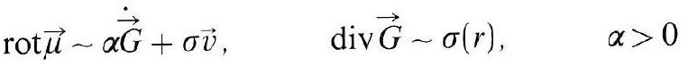
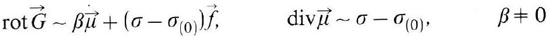
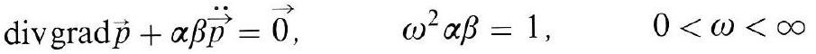
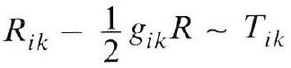
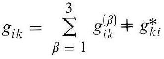
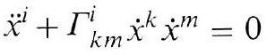
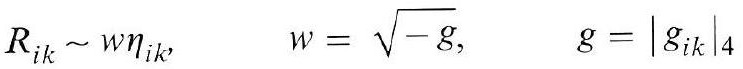
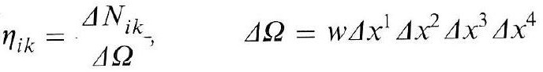
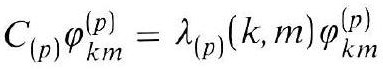
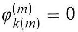

# Formula register — page 100

10 formulas from the Formelregister of [Introduction, with index of terms and formulas](../sources/BH3FR.md). The LaTeX is the MathPix reading; the scan beneath each one is the printed original.

### ("*")

$$
\operatorname{rot} \vec{\mu} \sim \alpha \dot{\vec{G}}+\sigma \vec{v}, \quad \operatorname{div} \vec{G} \sim \sigma(r), \quad \alpha>0
$$

*Unit `BH3FR_EQ0003`, page 100.*

### ("*a")

$$
\operatorname{rot} \vec{G} \sim \beta \dot{\vec{\mu}}+\left(\sigma-\sigma_{(0)}\right) \vec{f}, \quad \operatorname{div} \vec{\mu} \sim \sigma-\sigma_{(0)}, \quad \beta \neq 0
$$

*Unit `BH3FR_EQ0004`, page 100.*

### ("*b")

$$
\operatorname{divgrad} \vec{p}+\alpha \beta \ddot{\vec{p}}=\overrightarrow{0}, \quad \omega^{2} \alpha \beta=1, \quad 0<\omega<\infty
$$

*Unit `BH3FR_EQ0005`, page 100.*

### (1)

$$
R_{i k}-\frac{1}{2} g_{i k} R \sim T_{i k}
$$

*Unit `BH3FR_EQ0006`, page 100.*

### (1a)

$$
g_{i k}=\sum_{\beta=1}^{3} g_{i k}^{(\beta)} \neq g_{k i}^{*}
$$

*Unit `BH3FR_EQ0007`, page 100.*

### (1b)

$$
\ddot{x}^{i}+\Gamma_{k m}^{i} \dot{x}^{k} \dot{x}^{m}=0
$$

*Unit `BH3FR_EQ0008`, page 100.*

### (2)

$$
R_{i k} \sim w \eta_{i k}, \quad w=\sqrt{-g}, \quad g=\left|g_{i k}\right|_{4}
$$

*Unit `BH3FR_EQ0009`, page 100.*

### (2a)

$$
\eta_{i k}=\begin{gathered} \Delta N_{i k} \\ \Delta \Omega \end{gathered}, \quad \Delta \Omega=w \Delta x^{1} \Delta x^{2} \Delta x^{3} \Delta x^{4}
$$

*Unit `BH3FR_EQ0010`, page 100.*

### (3)

$$
C_{(p)} \varphi_{k m}^{(p)}=\lambda_{(p)}(k, m) \varphi_{k m}^{(p)}
$$

*Unit `BH3FR_EQ0011`, page 100.*

### (3a)

$$
\varphi_{k(m)}^{(m)}=0
$$

*Unit `BH3FR_EQ0012`, page 100.*
