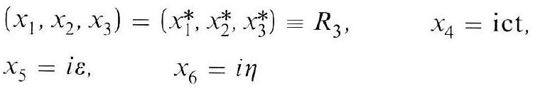
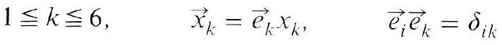
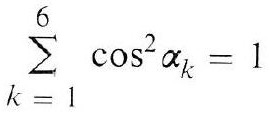
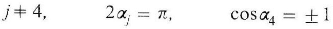
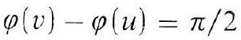
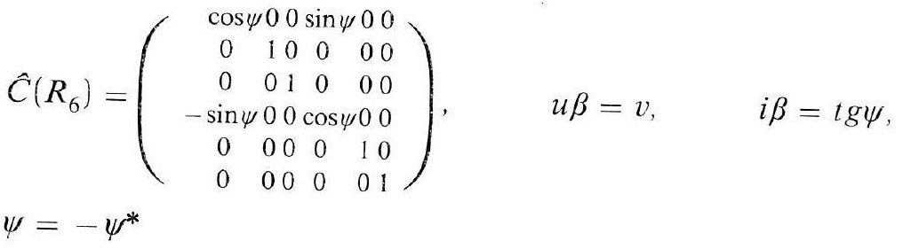
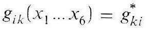
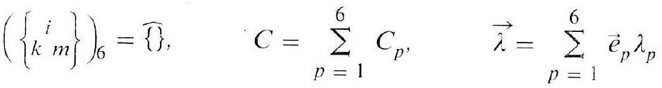
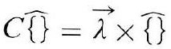

# Formula register — page 101

9 formulas from the Formelregister of [Introduction, with index of terms and formulas](../sources/BH3FR.md). The LaTeX is the MathPix reading; the scan beneath each one is the printed original.

### (4)

$$
\begin{aligned} & \left(x_{1}, x_{2}, x_{3}\right)=\left(x_{1}^{*}, x_{2}^{*}, x_{3}^{*}\right) \equiv R_{3}, \quad x_{4}=\mathrm{ict}, \\ & x_{5}=i \varepsilon, \quad x_{6}=i \eta \end{aligned}
$$

*Unit `BH3FR_EQ0013`, page 101.*

### (4a)

$$
1 \leqq k \leqq 6, \quad \vec{x}_{k}=\vec{e}_{k} x_{k}, \quad \vec{e}_{i} \vec{e}_{k}=\delta_{i k}
$$

*Unit `BH3FR_EQ0014`, page 101.*

### (5)

$$
\sum_{k=1}^{6} \cos ^{2} \alpha_{k}=1
$$

*Unit `BH3FR_EQ0015`, page 101.*

### (5a)

$$
j \neq 4, \quad 2 \alpha_{j}=\pi, \quad \cos \alpha_{4}= \pm 1
$$

*Unit `BH3FR_EQ0016`, page 101.*

### (5b)

$$
\varphi(v)-\varphi(u)=\pi / 2
$$

*Unit `BH3FR_EQ0017`, page 101.*

### (5c)

$$
\begin{aligned} & \hat{C}\left(R_{6}\right)=\left(\begin{array}{rrrrr} \cos \psi & 0 & 0 & \sin \psi & 0 \\ 0 & 1 & 0 & 0 \\ 0 & 0 & 1 & 0 & 0 \\ -\sin \psi & 0 & 0 & \cos \psi & 0 \\ 0 & 0 & 0 & 0 \\ 0 & 0 & 0 & 0 & 0 \end{array}\right), \quad u \beta=v, \quad i \beta=\operatorname{tg} \psi, \\ & \psi=-\psi^{*} \end{aligned}
$$

*Unit `BH3FR_EQ0018`, page 101.*

### (6)

$$
g_{i k}\left(x_{1} \ldots x_{6}\right)=g_{k i}^{*}
$$

*Unit `BH3FR_EQ0019`, page 101.*

### (7)

$$
\left.\left(\left\{\begin{array}{c} i \\ k m \end{array}\right\}\right)_{6}=\widehat{\{ }\right\}, \quad C=\sum_{p=1}^{6} C_{p}, \quad \vec{\lambda}=\sum_{p=1}^{6} \vec{e}_{p} \lambda_{p}
$$

*Unit `BH3FR_EQ0020`, page 101.*

### (8)

$$
C \widehat{\}}=\vec{\lambda} \times \widehat{\{ \}}
$$

*Unit `BH3FR_EQ0021`, page 101.*
