# Formula register — page 102

11 formulas from the Formelregister of [Introduction, with index of terms and formulas](../sources/BH3FR.md). The LaTeX is the MathPix reading; the scan beneath each one is the printed original.

### (8a)

$$
\operatorname{sp} \widehat{C} \widehat{\}}=\vec{\lambda} \widehat{\}}
$$

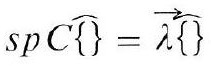

*Unit `BH3FR_EQ0022`, page 102.*

### (8b)

$$
\vec{\lambda} \| s p \widehat{\{ \}} \rightarrow \operatorname{grad}_{6} \ln w
$$

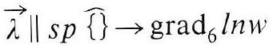

*Unit `BH3FR_EQ0023`, page 102.*

### (9)

$$
g_{i k}\left(g_{i k}^{(1)} \ldots g_{i k}^{(3)}\right)=g_{k i}^{*}, \quad g_{i k}^{(\mu)}\left(x_{1} \ldots x_{6}\right) \neq g_{k i}^{(\mu)^{*}}
$$

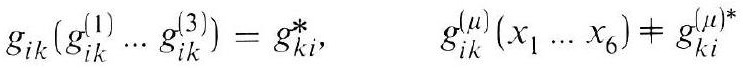

*Unit `BH3FR_EQ0024`, page 102.*

### (9a)

The OCR reading of this formula contains a character KaTeX will not typeset, so it is shown as extracted. The scan below is the authority.

```latex
\widehat{\}}=\sum_{\mu=1}^{3} \widehat{\{ \}}_{(\mu)}^{+}, \quad \sum_{\mu=1}^{3} \widehat{\{子}_{(\mu)}^{-}=\hat{0}
```

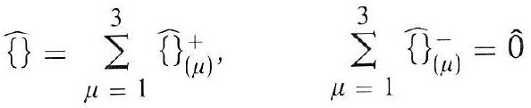

*Unit `BH3FR_EQ0025`, page 102.*

### (10)

$$
3 \omega=4 c, \quad \omega^{2} \alpha|\beta|=1
$$

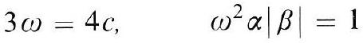

*Unit `BH3FR_EQ0026`, page 102.*

### (10a)

$$
64 \pi \gamma \alpha=3, \quad c^{2}|\beta|=12 \pi \gamma
$$

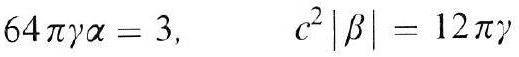

*Unit `BH3FR_EQ0027`, page 102.*

### (10b)

$$
8 \pi \gamma \alpha^{\prime}=1, \quad c^{2}\left|\beta^{\prime}\right|=8 \pi \gamma, \quad \omega^{\prime}=c
$$

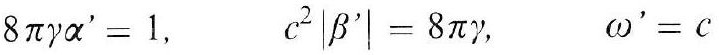

*Unit `BH3FR_EQ0028`, page 102.*

### (10c)

$$
\alpha \operatorname{div} \vec{G}=\Lambda m(r), \quad 16 V \Lambda=\left[3 V \frac{d}{d V}+1\right]^{2}
$$

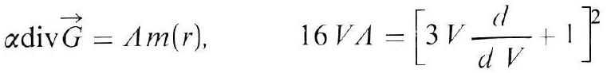

*Unit `BH3FR_EQ0029`, page 102.*

### (11)

$$
\begin{aligned} & r q e^{-q}=A(1-r / \varsigma)^{2}, \quad 16 c^{2} A=3 \gamma M_{o}, \quad M=L m \\ & 1 \leqq L<\infty \end{aligned}
$$

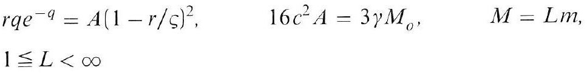

*Unit `BH3FR_EQ0030`, page 102.*

### (11a)

$$
q=1-\sqrt{1-\varepsilon \varphi}, \quad 8 c^{2} \varepsilon=3
$$

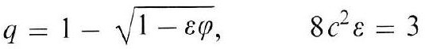

*Unit `BH3FR_EQ0031`, page 102.*

### (11b)

$$
r \varphi(r)=\gamma \operatorname{Lm}(r)(1-r / \varsigma)^{2}
$$

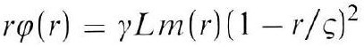

*Unit `BH3FR_EQ0032`, page 102.*
