# Formula register — page 103

11 formulas from the Formelregister of [Introduction, with index of terms and formulas](../sources/BH3FR.md). The LaTeX is the MathPix reading; the scan beneath each one is the printed original.

### (11c)

$$
r^{2} G=-\gamma M_{0}\left(1-(r / \varsigma)^{2}\right) e^{q}(1+q)^{-1}
$$

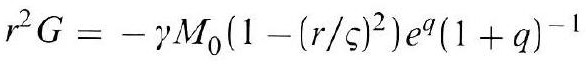

*Unit `BH3FR_EQ0033`, page 103.*

### (12)

$$
Y_{1} \varsigma\left(1-h\left(2 Y_{1} m_{0} c \varsigma\right)^{-1}\right)^{2}=\frac{h^{2}}{\gamma m_{0}^{3}} . \quad 2 Y_{1} m_{0} c \varsigma>h
$$

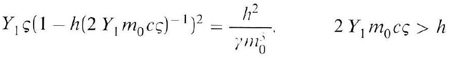

*Unit `BH3FR_EQ0034`, page 103.*

### (12a)

$$
\gamma m_{0}^{3} Y_{1} \varsigma=h^{2}, \quad 2 Y_{1} m_{o} c \varsigma \ngtr>h
$$

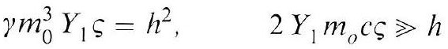

*Unit `BH3FR_EQ0035`, page 103.*

### (12b)

$$
A_{t}^{3} \varsigma \approx 46[M p c]
$$

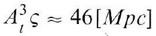

*Unit `BH3FR_EQ0036`, page 103.*

### (13)

$$
\begin{array}{lcr} \varphi(r<\varrho)>O, & G(r<\varrho)<O, & \varphi(\varrho)=O, \\ G(\varrho)=O, & \varphi(r>\varrho)>O, & G(r>\varrho)>O \end{array}
$$

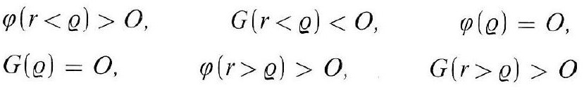

*Unit `BH3FR_EQ0037`, page 103.*

### (14)

$$
R_{ \pm}=\varsigma(1+\alpha)\left(1 \pm \sqrt{1-(1+\alpha)^{-2}}\right), \quad \alpha e \gamma M_{0}=2 \omega c \varsigma
$$

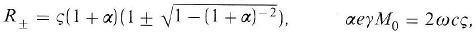

*Unit `BH3FR_EQ0038`, page 103.*

### (14a)

$$
R_{+}=2 \alpha \varsigma, \quad 2 \alpha R_{-}=\varsigma, \quad R_{+} R_{-}=\varsigma^{2}
$$

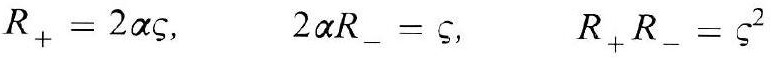

*Unit `BH3FR_EQ0039`, page 103.*

### (14b)

$$
4 \omega c R_{-}=e \gamma M_{0}
$$

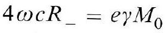

*Unit `BH3FR_EQ0040`, page 103.*

### (14c)

$$
\begin{array}{ll} R_{-}<r \leqq \varsigma, & (G \leqq 0), \quad \varsigma<r \leqq R_{+}<\infty \\ (G>0) & \end{array}
$$

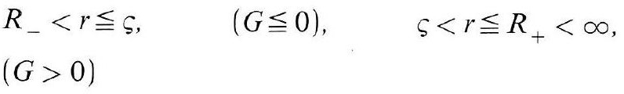

*Unit `BH3FR_EQ0041`, page 103.*

### (15)

$$
\tau \omega c^{2}=\pi \gamma \hbar
$$

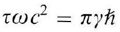

*Unit `BH3FR_EQ0042`, page 103.*

### (15a')

$$
F\left(x_{1} \ldots x_{6}\right)=N \tau, \quad N>0
$$

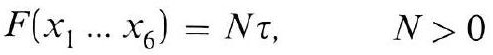

*Unit `BH3FR_EQ0043`, page 103.*
