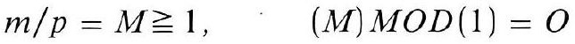
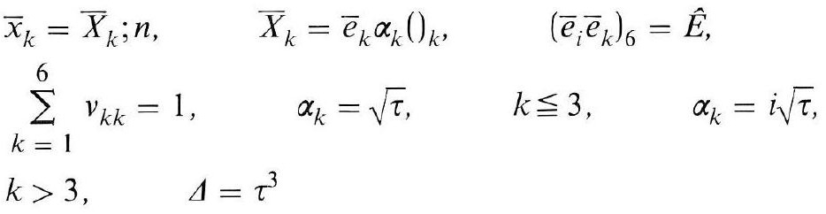
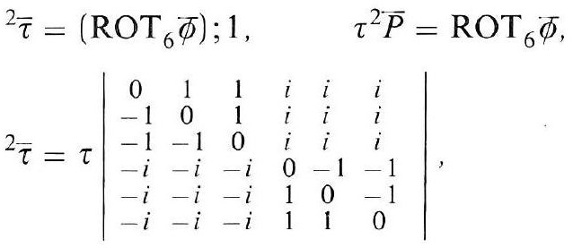
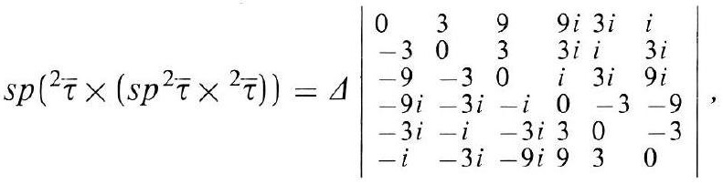
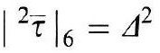
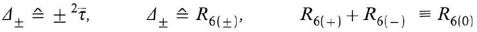
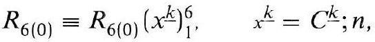
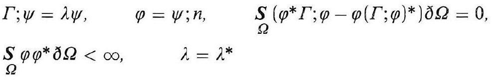

# Formula register — page 104

8 formulas from the Formelregister of [Introduction, with index of terms and formulas](../sources/BH3FR.md). The LaTeX is the MathPix reading; the scan beneath each one is the printed original.

### (15b)

$$
m / p=M \geqq 1, \quad(M) M O D(1)=O
$$

*Unit `BH3FR_EQ0044`, page 104.*

### (16)

$$
\begin{aligned} & \bar{x}_{k}=\bar{X}_{k} ; n, \quad \bar{X}_{k}=\bar{e}_{k} \alpha_{k}()_{k}, \quad\left(\bar{e}_{i} \bar{e}_{k}\right)_{6}=\hat{E}, \\ & \sum_{k=1}^{6} v_{k k}=1, \quad \alpha_{k}=\sqrt{\tau}, \quad k \leqq 3, \quad \alpha_{k}=i \sqrt{\tau}, \\ & k>3, \quad \Delta=\tau^{3} \end{aligned}
$$

*Unit `BH3FR_EQ0045`, page 104.*

### BH3FR_EQ0046

$$
\begin{aligned} { }^{2} \bar{\tau} & =\left(\operatorname{ROT}_{6} \bar{\phi}\right) ; 1, \\ { }^{2} \bar{\tau} & =\tau\left|\begin{array}{cccccc} 0 & 1 & 1 & i & i & i \\ -1 & 0 & 1 & i & i & i \\ -1 & -1 & 0 & i & i & i \\ -i & -i & -i & 0 & -1 & -1 \\ -i & -i & -i & 1 & 0 & -1 \\ -i & -i & -i & 1 & 1 & 0 \end{array}\right| \end{aligned}
$$

*Unit `BH3FR_EQ0046`, page 104.*

### BH3FR_EQ0047

$$
s p\left({ }^{2} \bar{\tau} \times\left(s p^{2} \bar{\tau} \times{ }^{2} \bar{\tau}\right)\right)=\Delta\left|\begin{array}{llllll} 0 & 3 & 9 & 9 i & 3 i & i \\ -3 & 0 & 3 & 3 i & 3 i \\ -9 & -3 & 0 & i & 3 i & 9 i \\ -9 i & -3 i & -i & 0 & -3 & -9 \\ -3 i & -i & -3 i & 3 & 0 & -3 \\ -i & -3 i & -9 i & 9 & 3 & 0 \end{array}\right|
$$

*Unit `BH3FR_EQ0047`, page 104.*

### (16a)

$$
\left.\left.\right|^{2} \bar{\tau}\right|_{6}=\Delta^{2}
$$

*Unit `BH3FR_EQ0048`, page 104.*

### (16b)

$$
\Delta_{ \pm} \hat{=} \pm{ }^{2} \bar{\tau}, \quad \Delta_{ \pm} \hat{=} R_{6( \pm)}, \quad R_{6(+)}+R_{6(-)} \equiv R_{6(0)}
$$

*Unit `BH3FR_EQ0049`, page 104.*

### (16c)

$$
R_{6(0)} \equiv R_{6(0)}\left(x^{\underline{k}}\right)_{1}^{6}, \quad x^{\underline{k}}=C^{\underline{k}} ; n
$$

*Unit `BH3FR_EQ0050`, page 104.*

### (17)

$$
\begin{array}{cc} \Gamma ; \psi=\lambda \psi, & \varphi=\psi ; n, \quad \underset{\Omega}{S}\left(\varphi^{*} \Gamma ; \varphi-\varphi(\Gamma ; \varphi)^{*}\right) \delta \Omega=0, \\ S_{\Omega} \varphi \varphi^{*} \partial \Omega<\infty, \quad \lambda=\lambda^{*} \end{array}
$$

*Unit `BH3FR_EQ0051`, page 104.*
