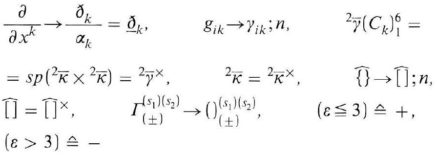
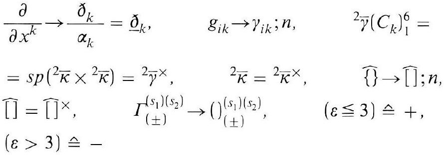
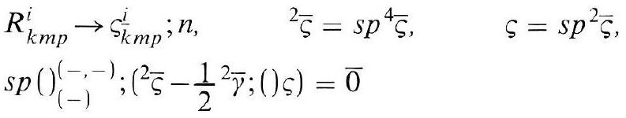
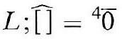
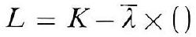
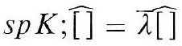
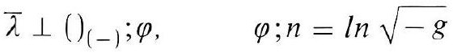
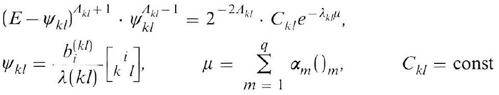

# Formula register — page 105

8 formulas from the Formelregister of [Introduction, with index of terms and formulas](../sources/BH3FR.md). The LaTeX is the MathPix reading; the scan beneath each one is the printed original.

### (18)

$$

$$

*Unit `BH3FR_EQ0052`, page 105.*

### BH3FR_EQ0053

$$
\begin{aligned} & \frac{\partial}{\partial x^{k}} \rightarrow \frac{\partial_{k}}{\alpha_{k}}=\underline{\partial}_{k}, \quad g_{i k} \rightarrow \gamma_{i k} ; n, \quad{ }^{2} \bar{\gamma}\left(C_{k}\right)_{1}^{6}= \\ & \left.=s p\left({ }^{2} \bar{\kappa} \times{ }^{2} \bar{\kappa}\right)={ }^{2} \bar{\gamma}^{\times}, \quad{ }^{2} \bar{\kappa}={ }^{2} \bar{\kappa}^{\times}, \quad \widehat{\{ \}} \rightarrow \widehat{[ }\right] ; n, \\ & \widehat{[ }]=\widehat{\Gamma}^{\times}, \quad \Gamma_{( \pm)}^{\left(s_{1}\right)\left(s_{2}\right)} \rightarrow()_{( \pm)}^{\left(s_{1}\right)\left(s_{2}\right)}, \quad(\varepsilon \leqq 3) \hat{=}+, \\ & (\varepsilon>3) \triangleq- \end{aligned}
$$

*Unit `BH3FR_EQ0053`, page 105.*

### (18а)

$$
\begin{aligned} & R_{k m p}^{i} \rightarrow \varsigma_{k m p}^{i} ; n, \quad{ }^{2} \bar{\varsigma}=s p^{4} \bar{\varsigma}, \quad \varsigma=s p^{2} \bar{\varsigma} \\ & s p()_{(-)}^{(-,-)} ;\left({ }^{2} \bar{\varsigma}-\frac{1}{2}^{2} \bar{\gamma} ;() \varsigma\right)=\overline{0} \end{aligned}
$$

*Unit `BH3FR_EQ0054`, page 105.*

### (19)

$$
L ; \widehat{[]}={ }^{4} \overline{0}
$$

*Unit `BH3FR_EQ0055`, page 105.*

### (19a)

$$
L=K-\bar{\lambda} \times()
$$

*Unit `BH3FR_EQ0056`, page 105.*

### (19b)

$$
\operatorname{sp} K ; \widehat{[]}=\widehat{\lambda[]}
$$

*Unit `BH3FR_EQ0057`, page 105.*

### (19c)

$$
\bar{\lambda} \perp()_{(-)} ; \varphi, \quad \varphi ; n=\ln \sqrt{-g}
$$

*Unit `BH3FR_EQ0058`, page 105.*

### (20)

$$
\begin{aligned} & \left(E-\psi_{k l}\right)^{\Lambda_{k l}+1} \cdot \psi_{k l}^{\Lambda_{k l}-1}=2^{-2 \Lambda_{k l}} \cdot C_{k l} e^{-\lambda_{k l} \mu}, \\ & \psi_{k l}=\frac{b_{i}^{(k l)}}{\lambda(k l)}\left[\begin{array}{c} i \\ k l \end{array}\right], \quad \mu=\sum_{m=1}^{q} \alpha_{m}()_{m}, \quad C_{k l}=\mathrm{const} \end{aligned}
$$

*Unit `BH3FR_EQ0059`, page 105.*
