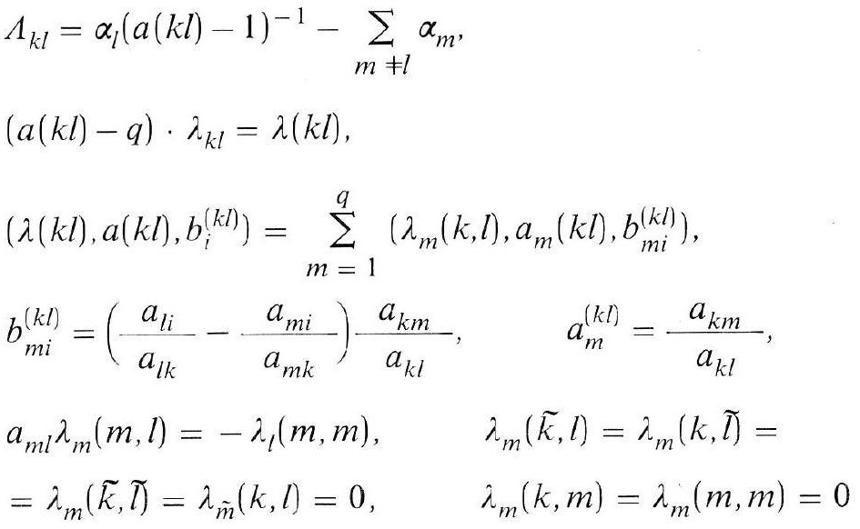
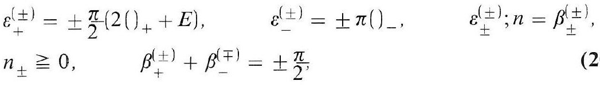
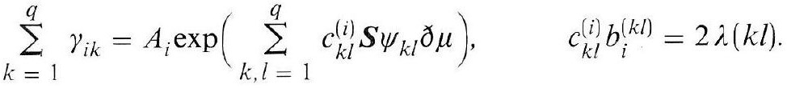
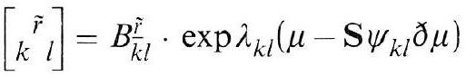
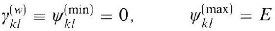

# Formula register — page 106

5 formulas from the Formelregister of [Introduction, with index of terms and formulas](../sources/BH3FR.md). The LaTeX is the MathPix reading; the scan beneath each one is the printed original.

### (20a)

$$
\begin{aligned} & \Lambda_{k l}=\alpha_{l}(a(k l)-1)^{-1}-\sum_{m \neq l} \alpha_{m} \\ & (a(k l)-q) \cdot \lambda_{k l}=\lambda(k l), \\ & \left(\lambda(k l), a(k l), b_{i}^{(k l)}\right)=\sum_{m=1}^{q}\left(\lambda_{m}(k, l), a_{m}(k l), b_{m i}^{(k l)}\right), \\ & b_{m i}^{(k l)}=\left(\frac{a_{l i}}{a_{l k}}-\frac{a_{m i}}{a_{m k}}\right) \frac{a_{k m}}{a_{k l}}, \quad a_{m}^{(k l)}=\frac{a_{k m}}{a_{k l}}, \quad \lambda_{m}(\tilde{k}, l)=\lambda_{m}(k, \tilde{l})= \\ & a_{m l} \lambda_{m}(m, l)=-\lambda_{l}(m, m), \quad \lambda_{m}(k, m)=\lambda_{m}(m, m)=0 \\ & =\lambda_{m}(\tilde{k}, \tilde{l})=\lambda_{\tilde{m}}(k, l)=0, \quad \end{aligned}
$$

*Unit `BH3FR_EQ0060`, page 106.*

### (20b)

$$
\begin{array}{ll} \varepsilon_{+}^{( \pm)}= \pm \frac{\pi}{2}\left(2()_{+}+E\right), & \varepsilon_{-}^{( \pm)}= \pm \pi()_{-}, \\ n_{ \pm} \geqq 0, & \beta_{+}^{( \pm)}+\beta_{-}^{(\mp)}= \pm \frac{\pi}{2}, \end{array}
$$

*Unit `BH3FR_EQ0061`, page 106.*

### (21)

$$
\sum_{k=1}^{q} \gamma_{i k}=A_{i} \exp \left(\sum_{k, l=1}^{q} c_{k l}^{(i)} \boldsymbol{S} \psi_{k l} \partial \mu\right), \quad c_{k l}^{(i)} b_{i}^{(k l)}=2 \lambda(k l)
$$

*Unit `BH3FR_EQ0062`, page 106.*

### (21a)

$$
\left[\begin{array}{cc} \tilde{r} \\ k & l \end{array}\right]=B_{\bar{k} l}^{\tilde{r}} \cdot \exp \lambda_{k l}\left(\mu-\mathbf{S} \psi_{k l} \partial \mu\right)
$$

*Unit `BH3FR_EQ0063`, page 106.*

### (21b)

$$
\gamma_{k l}^{(w)} \equiv \psi_{k l}^{(\min )}=0, \quad \psi_{k l}^{(\max )}=E
$$

*Unit `BH3FR_EQ0064`, page 106.*
