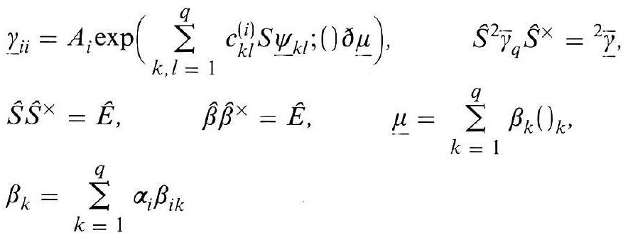
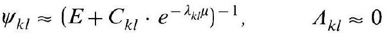
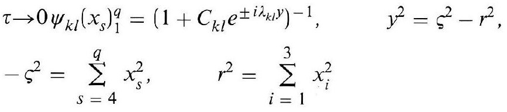
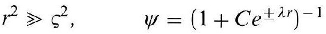
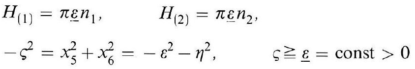
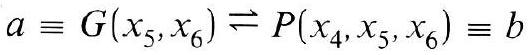

# Formula register — page 107

6 formulas from the Formelregister of [Introduction, with index of terms and formulas](../sources/BH3FR.md). The LaTeX is the MathPix reading; the scan beneath each one is the printed original.

### (21c)

$$
\begin{aligned} & \underline{\gamma}_{i i}=A_{i} \exp \left(\sum_{k, l=1}^{q} c_{k l}^{(i)} S \underline{\psi}_{k l} ;() \partial \underline{\mu}\right), \quad \hat{S}^{2} \bar{\gamma}_{q} \hat{S}^{\times}={ }^{2} \bar{\gamma}_{-} \\ & \hat{S} \hat{S}^{\times}=\hat{E}, \quad \hat{\beta} \hat{\beta}^{\times}=\hat{E}, \quad \underline{\mu}=\sum_{k=1}^{q} \beta_{k}()_{k}, \\ & \beta_{k}=\sum_{k=1}^{q} \alpha_{i} \beta_{i k} \end{aligned}
$$

*Unit `BH3FR_EQ0065`, page 107.*

### (22)

$$
\psi_{k l} \approx\left(E+C_{k l} \cdot e^{-\lambda_{k l} \mu}\right)^{-1}, \quad \Lambda_{k l} \approx 0
$$

*Unit `BH3FR_EQ0066`, page 107.*

### (22a)

$$
\begin{aligned} & \tau \rightarrow 0 \psi_{k l}\left(x_{s}\right)_{1}^{q}=\left(1+C_{k l} e^{ \pm i \lambda_{k l} y}\right)^{-1}, \quad y^{2}=\varsigma^{2}-r^{2}, \\ & -\varsigma^{2}=\sum_{s=4}^{q} x_{s}^{2}, \quad r^{2}=\sum_{i=1}^{3} x_{i}^{2} \end{aligned}
$$

*Unit `BH3FR_EQ0067`, page 107.*

### (22b)

$$
r^{2} \gg \varsigma^{2}, \quad \psi=\left(1+C e^{ \pm \lambda r}\right)^{-1}
$$

*Unit `BH3FR_EQ0068`, page 107.*

### (23)

$$
\begin{aligned} & H_{(1)}=\pi \underline{\varepsilon} n_{1}, \quad H_{(2)}=\pi \underline{\varepsilon} n_{2}, \\ & -\varsigma^{2}=x_{5}^{2}+x_{6}^{2}=-\varepsilon^{2}-\eta^{2}, \quad \leqslant \underline{\varepsilon}=\text { const }>0 \end{aligned}
$$

*Unit `BH3FR_EQ0069`, page 107.*

### (24)

$$
a \equiv G\left(x_{5}, x_{6}\right) \rightleftharpoons P\left(x_{4}, x_{5}, x_{6}\right) \equiv b
$$

*Unit `BH3FR_EQ0070`, page 107.*
