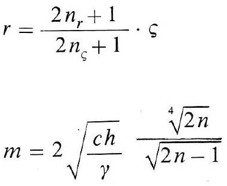
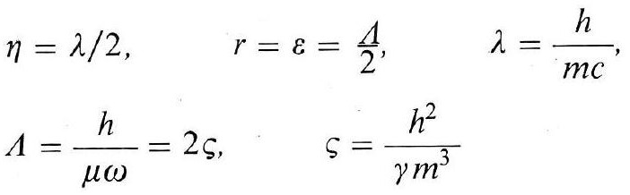
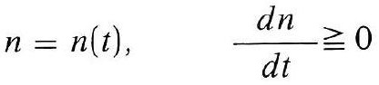
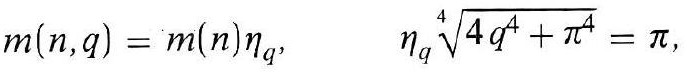
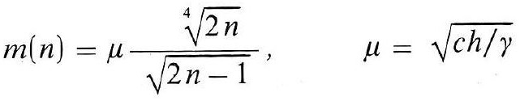
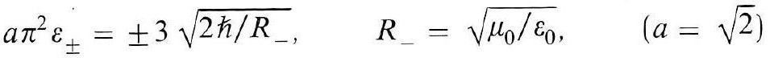
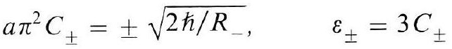

# Formula register — page 108

7 formulas from the Formelregister of [Introduction, with index of terms and formulas](../sources/BH3FR.md). The LaTeX is the MathPix reading; the scan beneath each one is the printed original.

### (26)

$$
\begin{aligned} & r=\frac{2 n_{r}+1}{2 n_{\varsigma}+1} \cdot \varsigma \\ & m=2 \sqrt{\frac{c h}{\gamma}} \frac{\sqrt[4]{2 n}}{\sqrt{2 n-1}} \end{aligned}
$$

*Unit `BH3FR_EQ0071`, page 108.*

### (26a)

$$
\begin{aligned} & \eta=\lambda / 2, \quad r=\varepsilon=\frac{\Lambda}{2}, \quad \lambda=\frac{h}{m c}, \\ & \Lambda=\frac{h}{\mu \omega}=2 \varsigma, \quad \varsigma=\frac{h^{2}}{\gamma m^{3}} \end{aligned}
$$

*Unit `BH3FR_EQ0072`, page 108.*

### (26b)

$$
n=n(t), \quad \frac{d n}{d t} \geqq 0
$$

*Unit `BH3FR_EQ0073`, page 108.*

### (27)

$$
m(n, q)=m(n) \eta_{q}, \quad \eta_{q} \sqrt[4]{4 q^{4}+\pi^{4}}=\pi
$$

*Unit `BH3FR_EQ0074`, page 108.*

### (27a)

$$
m(n)=\mu \frac{\sqrt[4]{2 n}}{\sqrt{2 n-1}}, \quad \mu=\sqrt{c h / \gamma}
$$

*Unit `BH3FR_EQ0075`, page 108.*

### (27b)

$$
a \pi^{2} \varepsilon_{ \pm}= \pm 3 \sqrt{2 \hbar / R_{-}}, \quad R_{-}=\sqrt{\mu_{0} / \varepsilon_{0}}, \quad(a=\sqrt{2})
$$

*Unit `BH3FR_EQ0076`, page 108.*

### (27 mathrm{c})

$$
a \pi^{2} C_{ \pm}= \pm \sqrt{2 \hbar / R_{-}}, \quad \varepsilon_{ \pm}=3 C_{ \pm}
$$

*Unit `BH3FR_EQ0077`, page 108.*
