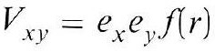
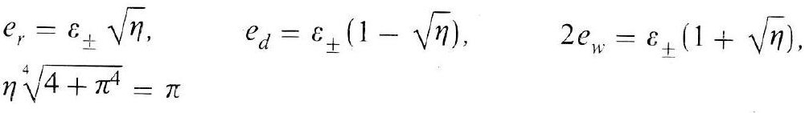
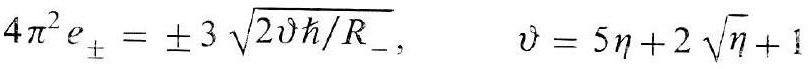
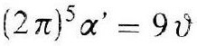
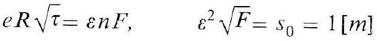
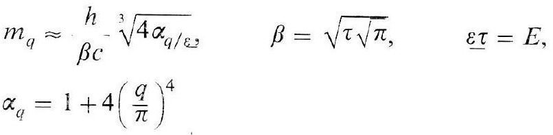
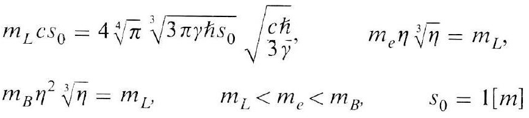

# Formula register — page 109

7 formulas from the Formelregister of [Introduction, with index of terms and formulas](../sources/BH3FR.md). The LaTeX is the MathPix reading; the scan beneath each one is the printed original.

### (28)

$$
V_{x y}=e_{x} e_{y} f(r)
$$



*Unit `BH3FR_EQ0078`, page 109.*

### (28a)

$$
\begin{aligned} & e_{r}=\varepsilon_{ \pm} \sqrt{\eta}, \quad e_{d}=\varepsilon_{ \pm}(1-\sqrt{\eta}), \quad 2 e_{w}=\varepsilon_{ \pm}(1+\sqrt{\eta}), \\ & \eta \sqrt[4]{4+\pi^{4}}=\pi \end{aligned}
$$



*Unit `BH3FR_EQ0079`, page 109.*

### (29)

$$
4 \pi^{2} e_{ \pm}= \pm 3 \sqrt{2 \vartheta \hbar / R_{-}}, \quad \vartheta=5 \eta+2 \sqrt{\eta}+1
$$



*Unit `BH3FR_EQ0080`, page 109.*

### (29a)

$$
(2 \pi)^{5} \alpha^{\prime}=9 \vartheta
$$



*Unit `BH3FR_EQ0081`, page 109.*

### (30)

$$
e R \sqrt{\tau}=\varepsilon n F, \quad \varepsilon^{2} \sqrt{F}=s_{0}=1[m]
$$



*Unit `BH3FR_EQ0082`, page 109.*

### (31)

$$
\begin{aligned} & m_{q} \approx{ }_{\beta c}^{h}-\sqrt[3]{4 \alpha_{q / \varepsilon}}, \quad \beta=\sqrt{\tau \sqrt{\pi}}, \quad \varepsilon \tau=E, \\ & \alpha_{q}=1+4\left(\frac{q}{\pi}\right)^{4} \end{aligned}
$$



*Unit `BH3FR_EQ0083`, page 109.*

### (32)

The OCR reading of this formula contains a character KaTeX will not typeset, so it is shown as extracted. The scan below is the authority.

```latex
\begin{aligned} & m_{L} c s_{0}=4 \sqrt[4]{\pi} \sqrt[3]{3 \pi \gamma \hbar s_{0}} \sqrt{\frac{c \hbar}{3 প}}, \quad m_{e} \eta \sqrt[3]{\eta}=m_{L}, \\ & m_{B} \eta^{2} \sqrt[3]{\eta}=m_{L}, \quad m_{L}<m_{e}<m_{B}, \quad s_{0}=1[m] \end{aligned}
```



*Unit `BH3FR_EQ0084`, page 109.*
