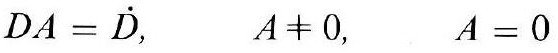
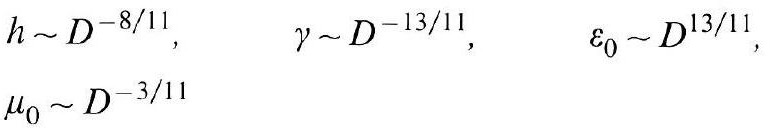
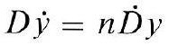
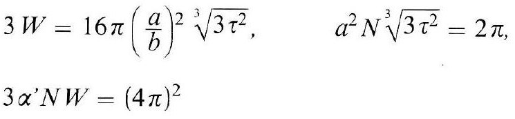
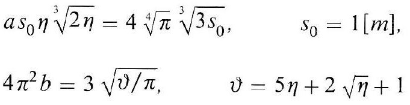
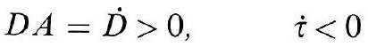
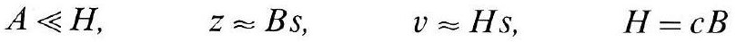
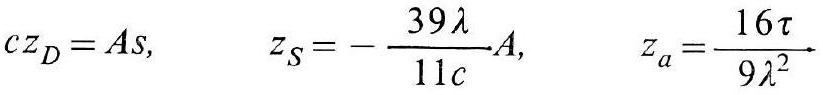
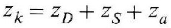
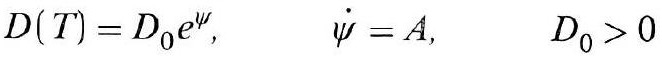

# Formula register — page 111

10 formulas from the Formelregister of [Introduction, with index of terms and formulas](../sources/BH3FR.md). The LaTeX is the MathPix reading; the scan beneath each one is the printed original.

### (38)

$$
D A=\dot{D}, \quad A \neq 0, \quad A=0
$$

*Unit `BH3FR_EQ0094`, page 111.*

### (39)

$$
\begin{aligned} & h \sim D^{-8 / 11}, \quad \gamma \sim D^{-13 / 11}, \quad \varepsilon_{0} \sim D^{13 / 11}, \\ & \mu_{0} \sim D^{-3 / 11} \end{aligned}
$$

*Unit `BH3FR_EQ0095`, page 111.*

### (39a)

$$
D \dot{y}=n \dot{D} y
$$

*Unit `BH3FR_EQ0096`, page 111.*

### (40)

$$
\begin{aligned} & 3 W=16 \pi\left(\frac{a}{b}\right)^{2} \sqrt[3]{3 \tau^{2}}, \quad a^{2} N^{3} \sqrt{3 \tau^{2}}=2 \pi \\ & 3 \alpha^{\prime} N W=(4 \pi)^{2} \end{aligned}
$$

*Unit `BH3FR_EQ0097`, page 111.*

### (40a)

$$
\begin{aligned} & a s_{0} \eta \sqrt[3]{2 \eta}=4 \sqrt[4]{\pi} \sqrt[3]{3 s_{0}}, \quad s_{0}=1[\mathrm{~m}], \\ & 4 \pi^{2} b=3 \sqrt{\vartheta / \pi}, \quad \vartheta=5 \eta+2 \sqrt{\eta}+1 \end{aligned}
$$

*Unit `BH3FR_EQ0098`, page 111.*

### (41)

$$
D A=\dot{D}>0, \quad \dot{\tau}<0
$$

*Unit `BH3FR_EQ0099`, page 111.*

### (41a)

$$
A \ll H, \quad z \approx B s, \quad v \approx H s, \quad H=c B
$$

*Unit `BH3FR_EQ0100`, page 111.*

### (42)

$$
c z_{D}=A s, \quad z_{S}=-\frac{39 \lambda}{11 c} A, \quad z_{a}=\frac{16 \tau}{9 \lambda^{2}}
$$

*Unit `BH3FR_EQ0101`, page 111.*

### (42a)

$$
z_{k}=z_{D}+z_{S}+z_{a}
$$

*Unit `BH3FR_EQ0102`, page 111.*

### (43)

$$
D(T)=D_{0} e^{\psi}, \quad \dot{\psi}=A, \quad D_{0}>0
$$

*Unit `BH3FR_EQ0103`, page 111.*
