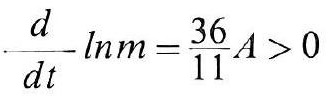
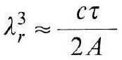
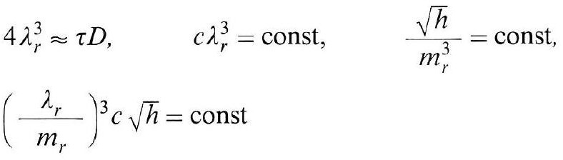
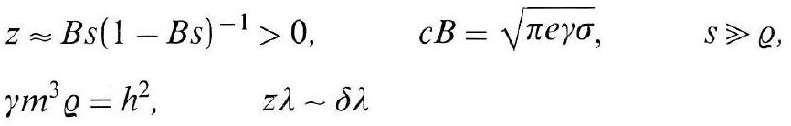
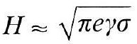
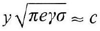
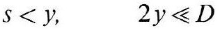
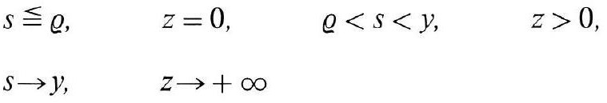

# Formula register — page 112

8 formulas from the Formelregister of [Introduction, with index of terms and formulas](../sources/BH3FR.md). The LaTeX is the MathPix reading; the scan beneath each one is the printed original.

### (43a)

$$
\frac{d}{d t} \ln m=\frac{36}{11} A>0
$$

*Unit `BH3FR_EQ0104`, page 112.*

### (44)

$$
\lambda_{r}^{3} \approx \frac{c \tau}{2 A}
$$

*Unit `BH3FR_EQ0105`, page 112.*

### (44a)

$$
\begin{aligned} & 4 \lambda_{r}^{3} \approx \tau D, \quad c \lambda_{r}^{3}=\text { const }, \quad \frac{\sqrt{h}}{m_{r}^{3}}=\text { const }, \\ & \left(\frac{\lambda_{r}}{m_{r}}\right)^{3} c \sqrt{h}=\text { const } \end{aligned}
$$

*Unit `BH3FR_EQ0106`, page 112.*

### (45)

$$
\begin{aligned} & z \approx B s(1-B s)^{-1}>0, \quad c B=\sqrt{\pi e \gamma \sigma}, \quad s \geqslant \rho, \\ & \gamma m^{3} \varrho=h^{2}, \quad z \lambda \sim \delta \lambda \end{aligned}
$$

*Unit `BH3FR_EQ0107`, page 112.*

### (45a)

$$
H \approx \sqrt{\pi e \gamma \sigma}
$$

*Unit `BH3FR_EQ0108`, page 112.*

### (46)

$$
y \sqrt{\pi e \gamma \sigma} \approx c
$$

*Unit `BH3FR_EQ0109`, page 112.*

### (46a)

$$
s<y, \quad 2 y \ll D
$$

*Unit `BH3FR_EQ0110`, page 112.*

### (46b)

$$
\begin{array}{llll} s \leqq \varrho, & z=0, & \varrho<s<y, & z>0 \\ s \rightarrow y, & z \rightarrow+\infty & & \end{array}
$$

*Unit `BH3FR_EQ0111`, page 112.*
