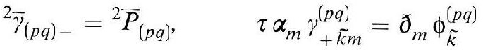
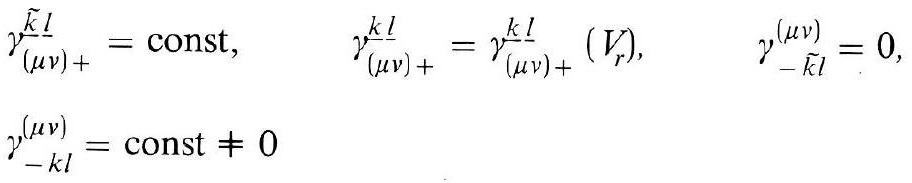
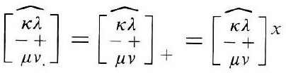
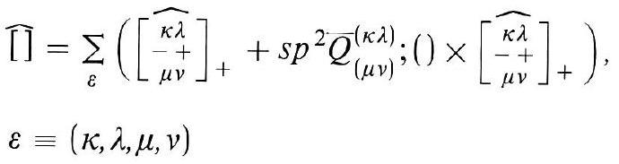
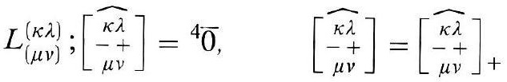
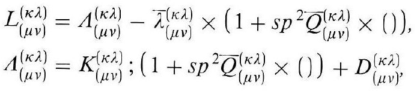
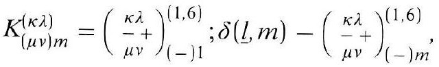
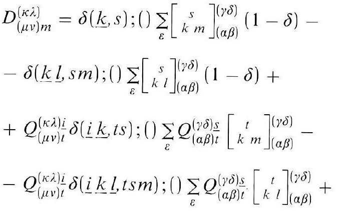

# Formula register — page 115

8 formulas from the Formelregister of [Introduction, with index of terms and formulas](../sources/BH3FR.md). The LaTeX is the MathPix reading; the scan beneath each one is the printed original.

### (55a)

$$
{ }^{2} \bar{\gamma}_{(p q)-}={ }^{2} \bar{P}_{(p q)}, \quad \tau \alpha_{m} \gamma_{+\widetilde{k} m}^{(p q)}=\partial_{m} \phi_{\widetilde{k}}^{(p q)}
$$

*Unit `BH3FR_EQ0127`, page 115.*

### (56)

$$
\begin{aligned} & \gamma_{(\mu v)+}^{\underline{\tilde{k}} \underline{l}}=\text { const }, \quad \gamma_{(\mu v)+}^{k \underline{l}}=\gamma_{(\mu v)+}^{k \underline{l}}\left(V_{r}\right), \quad \gamma_{-\widetilde{k} l}^{(\mu v)}=0, \\ & \gamma_{-k l}^{(\mu v)}=\text { const } \neq 0 \end{aligned}
$$

*Unit `BH3FR_EQ0128`, page 115.*

### (56a)

$$
\left[\begin{array}{c} \widehat{\kappa \lambda} \\ -t \\ \mu \nu \end{array}\right]=\left[\begin{array}{c} \widehat{\kappa \lambda} \\ -t \\ \mu \nu \end{array}\right]_{+}=\left[\begin{array}{c} \widehat{\kappa \lambda} \\ -t \\ \mu \nu \end{array}\right] x
$$

*Unit `BH3FR_EQ0129`, page 115.*

### (57)

$$
\begin{aligned} & \widehat{[]}=\sum_{\varepsilon}\left(\left[\begin{array}{c} \widehat{\kappa \lambda} \\ -+ \\ \mu \nu \end{array}\right]_{+}+s p^{2} Q_{(\mu \nu)}^{(\kappa \lambda)} ;() \times\left[\begin{array}{c} \widehat{\kappa \lambda} \\ -+ \\ \mu \nu \end{array}\right]_{+}\right), \\ & \varepsilon \equiv(\kappa, \lambda, \mu, v) \end{aligned}
$$

*Unit `BH3FR_EQ0130`, page 115.*

### (58)

$$
L_{(\mu \nu)}^{(\kappa \lambda)} ;\left[\begin{array}{c} \widehat{\kappa \lambda} \\ - \text { 十 }+ \\ \mu \nu \end{array}\right]={ }^{4} \overline{0}, \quad\left[\begin{array}{c} \widehat{\kappa \lambda} \\ -+ \\ \mu \nu \end{array}\right]=\left[\begin{array}{c} \widehat{\kappa \lambda} \\ -{ }^{\circ}+ \\ \mu \nu \end{array}\right]_{+}
$$

*Unit `BH3FR_EQ0131`, page 115.*

### BH3FR_EQ0132

$$
\begin{aligned} L_{(\mu \nu)}^{(\kappa \lambda)} & =\Lambda_{(\mu \nu)}^{(\kappa \lambda)}-\bar{\lambda}_{(\mu \nu)}^{(\kappa \lambda)} \times\left(1+s p^{2} \bar{Q}_{(\mu \nu)}^{(\kappa \lambda)} \times()\right), \\ \Lambda_{(\mu \nu)}^{(\kappa \lambda)} & =K_{(\mu \nu)}^{(\kappa \lambda \lambda)} ;\left(1+s p^{2} \bar{Q}_{(\mu \nu)}^{(\kappa \lambda)} \times()\right)+D_{(\mu \nu)}^{(\kappa \lambda)}, \end{aligned}
$$

*Unit `BH3FR_EQ0132`, page 115.*

### BH3FR_EQ0133

$$
K_{(\mu v) m}^{(\kappa \lambda)}=\binom{\kappa \lambda}{\mu \nu}_{(-) 1}^{(1,6)} ; \delta(\underline{l}, m)-\binom{\kappa \lambda}{\mu_{\nu}+}_{(-) m}^{(1,6)}
$$

*Unit `BH3FR_EQ0133`, page 115.*

### BH3FR_EQ0134

$$
\begin{aligned} & D_{(\mu \nu) m}^{(\kappa \lambda)}=\delta(\underline{k}, s) ;() \sum_{\varepsilon}\left[\begin{array}{c} s \\ k m \end{array}\right]_{(\alpha \beta)}^{(\gamma \delta)}(1-\delta)- \\ & -\delta(\underline{k} \underline{l}, s m) ;() \sum_{\varepsilon}\left[\begin{array}{c} s \\ k l \end{array}\right]_{(\alpha \beta)}^{(\gamma \delta)}(1-\delta)+ \\ & +Q_{(\mu \nu) t}^{(\kappa \lambda) \underline{i}} \delta(\underline{i} \underline{k}, t s) ;() \sum_{\varepsilon} Q_{(\alpha \beta) t}^{(\gamma \delta) \underline{s}}\left[\begin{array}{c} t \\ k^{\prime} m \end{array}\right]_{(\alpha \beta)}^{(\gamma \delta)}- \\ & -Q_{(\mu \nu) t}^{(\kappa \lambda) \underline{i}} \delta(\underline{i} \underline{k} \underline{l}, t s m) ;() \sum_{\varepsilon} Q_{(\alpha \beta) t}^{(\gamma \delta) \underline{s}}\left[\begin{array}{c} t \\ k^{\prime} l \end{array}\right]_{(\alpha \beta)}^{(\gamma \delta)}+ \end{aligned}
$$

*Unit `BH3FR_EQ0134`, page 115.*
