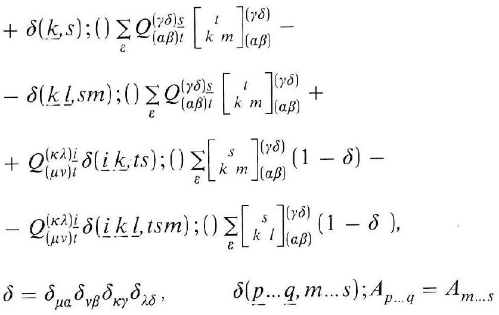
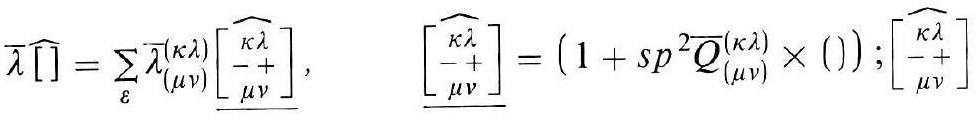
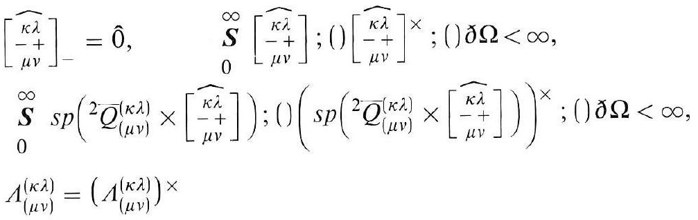
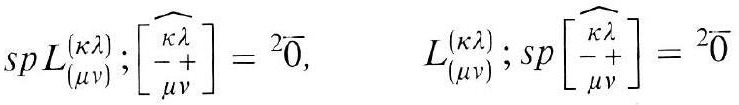
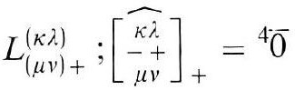

# Formula register — page 116

5 formulas from the Formelregister of [Introduction, with index of terms and formulas](../sources/BH3FR.md). The LaTeX is the MathPix reading; the scan beneath each one is the printed original.

### (58a)

$$
\begin{aligned} & +\delta(\underline{k}, s) ;() \sum_{\varepsilon} Q_{(\alpha \beta) t}^{(\gamma \delta) \underline{s}}\left[\begin{array}{c} t \\ k m \end{array}\right]_{(\alpha \beta)}^{(\gamma \delta)}- \\ & -\delta(\underline{k} \underline{l}, s m) ;() \sum_{\varepsilon} Q_{(\alpha \beta) t}^{(\gamma \delta) \underline{s}}\left[\begin{array}{c} t \\ k^{\prime} m \end{array}\right]_{(\alpha \beta)}^{(\gamma \delta)}+ \\ & +Q_{(\mu \nu) t}^{(\kappa \lambda) \underline{i}} \delta(\underline{i} \underline{k}, t s) ;() \sum_{\varepsilon}\left[\begin{array}{c} s \\ k m \end{array}\right]_{(\alpha \beta)}^{(\gamma \delta)}(1-\delta)- \\ & -Q_{(\mu \nu) t}^{(\kappa \lambda) i} \delta(\underline{i} \underline{k} \underline{l}, t s m) ;() \sum_{\varepsilon}\left[\begin{array}{c} s \\ k l \end{array}\right]_{(\alpha \beta)}^{(\gamma \delta)}(1-\delta) \\ & \delta=\delta_{\mu \alpha} \delta_{\nu \beta} \delta_{\kappa \gamma} \delta_{\lambda \delta}, \quad \delta(\underline{p} \ldots \underline{q}, m \ldots s) ; A_{p \ldots q}=A_{m \ldots s} \end{aligned}
$$

*Unit `BH3FR_EQ0135`, page 116.*

### (59)

$$
\bar{\lambda} \widehat{[ }]=\sum_{\varepsilon} \bar{\lambda}_{(\mu \nu)}^{(\kappa \lambda)}\left[\begin{array}{c} \widehat{\kappa \lambda} \\ -{ }^{\circ}+ \\ \mu \nu \end{array}\right], \quad\left[\begin{array}{c} \widehat{\kappa \lambda} \\ -{ }^{\circ}+ \\ \mu \nu \end{array}\right]=\left(1+s p^{2} \bar{Q}_{(\mu \nu)}^{(\kappa \lambda)} \times()\right) ;\left[\begin{array}{c} \widehat{\kappa \lambda} \\ -{ }_{\mu \nu} \end{array}\right]
$$

*Unit `BH3FR_EQ0136`, page 116.*

### (60)

$$
\begin{aligned} & {\left[\begin{array}{c} \widehat{\kappa \lambda} \\ -{ }^{+} \\ \mu \nu \end{array}\right]_{-}=\hat{0}, \quad \begin{array}{r} \boldsymbol{S} \\ 0 \\ {\left[\begin{array}{c} \kappa \lambda \\ -\mu \nu \end{array}\right] ;()\left[\begin{array}{c} \widehat{\kappa \lambda} \\ -+ \\ \mu \nu \end{array}\right] \times ;() \partial \Omega<\infty,} \\ \boldsymbol{S} \\ 0 \end{array} s p\left({ }^{2} Q_{(\mu \nu)}^{(\kappa \lambda)} \times\left[\begin{array}{c} \widehat{\kappa \lambda} \\ -+ \\ \mu \nu \end{array}\right]\right) ;()\left(s p\left({ }^{2} \bar{Q}_{(\mu \nu)}^{(\kappa \lambda)} \times\left[\begin{array}{c} \widehat{\kappa \lambda} \\ -+ \\ \mu \nu \end{array}\right]\right)\right)^{\times} ;() \partial \Omega<\infty,} \\ & \Lambda_{(\mu \nu)}^{(\kappa \lambda)}=\left(\Lambda_{(\mu \nu)}^{(\kappa \lambda)}\right) \times \end{aligned}
$$

*Unit `BH3FR_EQ0137`, page 116.*

### (60a)

$$
s p L_{(\mu \nu)}^{(\kappa \lambda)} ;\left[\begin{array}{c} \widehat{\kappa \lambda} \\ -{ }^{+} \\ \mu \nu \end{array}\right]={ }^{2} \overline{0}, \quad L_{(\mu \nu)}^{(\kappa \lambda)} ; s p\left[\begin{array}{c} \widehat{\kappa \lambda} \\ -{ }^{+} \\ \mu \nu \end{array}\right]={ }^{2} \overline{0}
$$

*Unit `BH3FR_EQ0138`, page 116.*

### (61)

$$
L_{(\mu \nu)+}^{(\kappa \lambda)} ;\left[\begin{array}{c} \widehat{\kappa \lambda} \\ -{ }^{\mu \nu} \end{array}\right]_{+}={ }^{4} \overline{0}
$$

*Unit `BH3FR_EQ0139`, page 116.*
