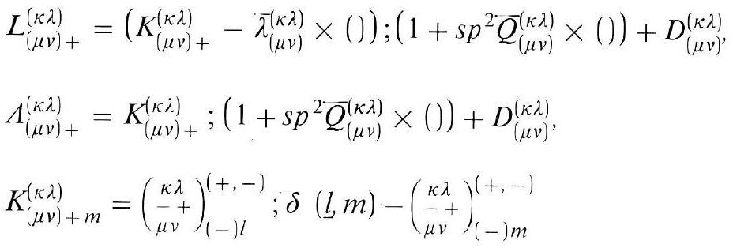
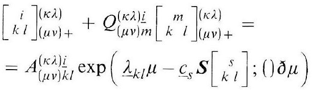
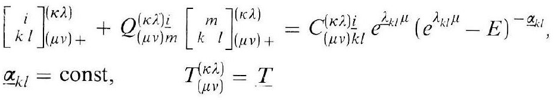
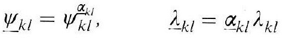
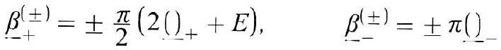
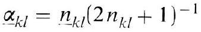
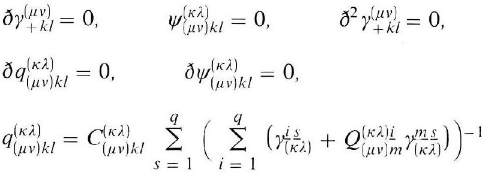

# Formula register — page 117

7 formulas from the Formelregister of [Introduction, with index of terms and formulas](../sources/BH3FR.md). The LaTeX is the MathPix reading; the scan beneath each one is the printed original.

### (61a)

$$
\begin{aligned} & L_{(\mu \nu)+}^{(\kappa \lambda)}=\left(K_{(\mu \nu)+}^{(\kappa \lambda)}-\bar{\lambda}_{(\mu \nu)}^{(\kappa \lambda)} \times()\right) ;\left(1+s p^{2} \bar{Q}_{(\mu \nu)}^{(\kappa \lambda)} \times()\right)+D_{(\mu \nu)}^{(\kappa \lambda)}, \\ & \Lambda_{(\mu \nu)+}^{(\kappa \lambda)}=K_{(\mu \nu)_{+}}^{(\kappa \lambda)} ;\left(1+s p^{2} \bar{Q}_{(\mu \nu)}^{(\kappa \lambda)} \times()\right)+D_{(\mu \nu)}^{(\kappa \lambda)}, \\ & K_{(\mu \nu)+m}^{(\kappa \lambda)}=\binom{\kappa \lambda+}{\mu \nu}_{(-) l}^{(+,-)} ; \delta(l, m)-\binom{\kappa \lambda}{\left.\mu^{+}\right)_{(-) m}^{+}}_{(-,-)}^{(+\lambda)} \end{aligned}
$$

*Unit `BH3FR_EQ0140`, page 117.*

### (62)

$$
\begin{aligned} & {\left[\begin{array}{c} i \\ k l \end{array}\right](\mu \lambda)+Q_{(\mu \nu)+}^{(\kappa \lambda) i}\left[\begin{array}{c} m \\ k \end{array}\right]\left(\begin{array}{l} \kappa \lambda) \\ (\mu \nu)+ \end{array}=\right.} \\ & =A_{(\mu \nu) k l}^{(\kappa \lambda) \frac{i}{k l}} \exp \left(\underline{\lambda}_{k l} \mu-\underline{c}_{s} \boldsymbol{S}\left[\begin{array}{c} s \\ k l \end{array}\right] ;() \partial_{\mu}\right) \end{aligned}
$$

*Unit `BH3FR_EQ0141`, page 117.*

### (63)

$$
\begin{aligned} & {\left[\begin{array}{c} i \\ k l \end{array}\right]_{(\mu \nu)+}^{(\kappa \lambda)}+Q_{(\mu \nu) m}^{(\kappa \lambda)}\left[\begin{array}{c} m \\ k \\ \underline{\alpha}_{k l} \end{array}\right]_{(\mu \nu)+}^{(\kappa \lambda)}=C_{(\mu \nu) k l}^{(\kappa \lambda) i} e^{\lambda_{k l} \mu}\left(e^{\lambda_{k l} \mu}-E\right)^{-\underline{\alpha}_{k l}},} \\ & T_{(\mu \nu)}^{(\kappa \lambda)}=T \end{aligned}
$$

*Unit `BH3FR_EQ0142`, page 117.*

### (64)

$$
\underline{\psi}_{k l}=\psi_{k l}^{\alpha_{k l}}, \quad \underline{\lambda}_{k l}=\underline{\alpha}_{k l} \lambda_{k l}
$$

*Unit `BH3FR_EQ0143`, page 117.*

### (65)

$$
\underline{\beta}_{+}^{( \pm)}= \pm \frac{\pi}{2}\left(2()_{+}+E\right), \quad \underline{\beta}_{-}^{( \pm)}= \pm \pi()
$$

*Unit `BH3FR_EQ0144`, page 117.*

### (65a)

$$
\alpha_{k l}=n_{k l}\left(2 n_{k l}+1\right)^{-1}
$$

*Unit `BH3FR_EQ0145`, page 117.*

### (66)

$$
\begin{aligned} & \partial \gamma_{+k l}^{(\mu \nu)}=0, \quad \psi_{(\mu \nu) k l}^{(\kappa \lambda)}=0, \quad \partial^{2} \gamma_{+k l}^{(\mu \nu)}=0, \\ & \partial q_{(\mu \nu) k l}^{(\kappa \lambda)}=0, \quad \partial \psi_{(\mu \nu) k l}^{(\kappa \lambda)}=0, \\ & q_{(\mu \nu) k l}^{(\kappa \lambda)}=C_{(\mu \nu) k l}^{(\kappa \lambda)} \sum_{s=1}^{q}\left(\sum_{i=1}^{q}\left(\gamma_{(\kappa \lambda)}^{i} \frac{S}{}+Q_{(\mu \nu) m}^{(\kappa \lambda)} \gamma_{(\kappa \lambda)}^{m} \frac{S}{\lambda}\right)\right)-1 \end{aligned}
$$

*Unit `BH3FR_EQ0146`, page 117.*
