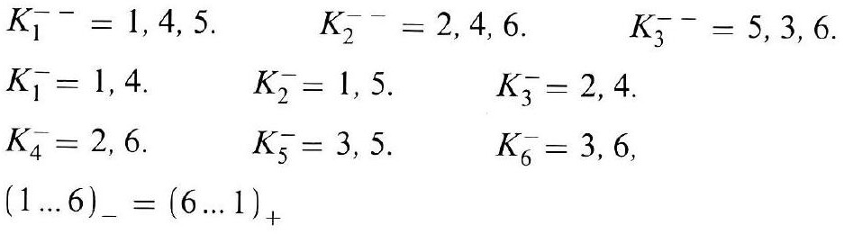
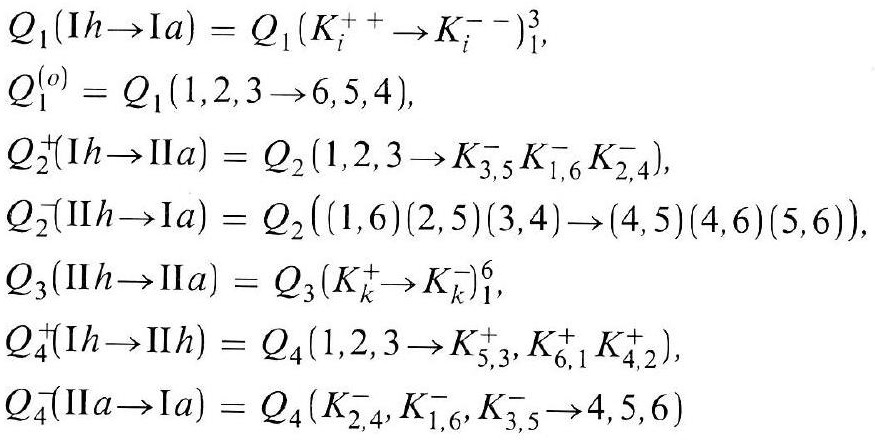
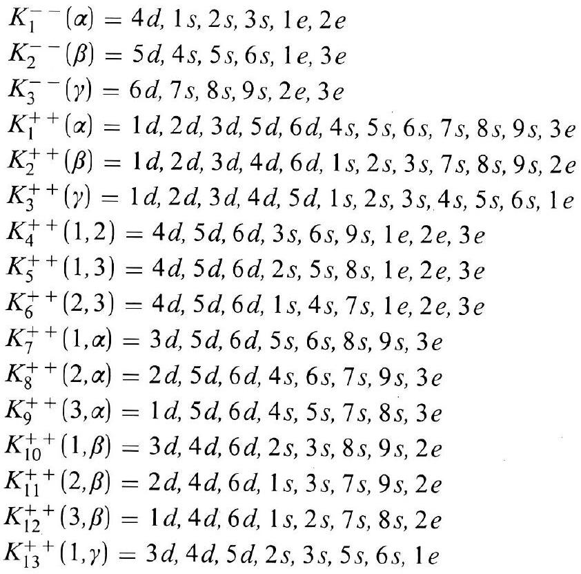

# Formula register — page 119

3 formulas from the Formelregister of [Introduction, with index of terms and formulas](../sources/BH3FR.md). The LaTeX is the MathPix reading; the scan beneath each one is the printed original.

### (70)

$$
\begin{array}{lll} K_{1}^{-}=1,4,5 . & K_{2}^{-}=2,4,6 . & K_{3}^{-}=5,3,6 . \\ K_{1}^{-}=1,4 . & K_{2}^{-}=1,5 . & K_{3}^{-}=2,4 . \\ K_{4}^{-}=2,6 . & K_{5}^{-}=3,5 . & K_{6}^{-}=3,6, \\ (1 \ldots 6)_{-}=(6 \ldots 1)_{+} & \end{array}
$$

*Unit `BH3FR_EQ0154`, page 119.*

### (70a)

$$
\begin{aligned} & Q_{1}(\mathrm{I} h \rightarrow \mathrm{I} a)=Q_{1}\left(K_{i}^{++} \rightarrow K_{i}^{--}\right)_{1}^{3}, \\ & Q_{1}^{(o)}=Q_{1}(1,2,3 \rightarrow 6,5,4), \\ & Q_{2}^{+}(\mathrm{I} h \rightarrow \mathrm{I} I a)=Q_{2}\left(1,2,3 \rightarrow K_{3,5}^{-} K_{1,6}^{-} K_{2,4}^{-}\right), \\ & Q_{2}^{-}(\mathrm{II} h \rightarrow \mathrm{I} a)=Q_{2}((1,6)(2,5)(3,4) \rightarrow(4,5)(4,6)(5,6)), \\ & Q_{3}(\mathrm{II} h \rightarrow \mathrm{II} a)=Q_{3}\left(K_{k}^{+} \rightarrow K_{k}^{-}\right)_{1}^{6}, \\ & Q_{4}^{+}(\mathrm{I} h \rightarrow \mathrm{II} h)=Q_{4}\left(1,2,3 \rightarrow K_{5,3}^{+}, K_{6,1}^{+} K_{4,2}^{+}\right), \\ & Q_{4}^{-}(\mathrm{II} a \rightarrow \mathrm{I} a)=Q_{4}\left(K_{2,4}^{-}, K_{1,6}^{-}, K_{3,5}^{-} \rightarrow 4,5,6\right) \end{aligned}
$$

*Unit `BH3FR_EQ0155`, page 119.*

### BH3FR_EQ0156

$$
\begin{aligned} & K_{1}^{--}(\alpha)=4 d, 1 s, 2 s, 3 s, 1 e, 2 e \\ & K_{2}^{--}(\beta)=5 d, 4 s, 5 s, 6 s, 1 e, 3 e \\ & K_{3}^{--}(\gamma)=6 d, 7 s, 8 s, 9 s, 2 e, 3 e \\ & K_{1}^{++}(\alpha)=1 d, 2 d, 3 d, 5 d, 6 d, 4 s, 5 s, 6 s, 7 s, 8 s, 9 s, 3 e \\ & K_{2}^{++}(\beta)=1 d, 2 d, 3 d, 4 d, 6 d, 1 s, 2 s, 3 s, 7 s, 8 s, 9 s, 2 e \\ & K_{3}^{++}(\gamma)=1 d, 2 d, 3 d, 4 d, 5 d, 1 s, 2 s, 3 s, 4 s, 5 s, 6 s, 1 e \\ & K_{4}^{++}(1,2)=4 d, 5 d, 6 d, 3 s, 6 s, 9 s, 1 e, 2 e, 3 e \\ & K_{5}^{++}(1,3)=4 d, 5 d, 6 d, 2 s, 5 s, 8 s, 1 e, 2 e, 3 e \\ & K_{6}^{++}(2,3)=4 d, 5 d, 6 d, 1 s, 4 s, 7 s, 1 e, 2 e, 3 e \\ & K_{7}^{++}(1, \alpha)=3 d, 5 d, 6 d, 5 s, 6 s, 8 s, 9 s, 3 e \\ & K_{8}^{++}(2, \alpha)=2 d, 5 d, 6 d, 4 s, 6 s, 7 s, 9 s, 3 e \\ & K_{9}^{++}(3, \alpha)=1 d, 5 d, 6 d, 4 s, 5 s, 7 s, 8 s, 3 e \\ & K_{10}^{++}(1, \beta)=3 d, 4 d, 6 d, 2 s, 3 s, 8 s, 9 s, 2 e \\ & K_{11}^{++}(2, \beta)=2 d, 4 d, 6 d, 1 s, 3 s, 7 s, 9 s, 2 e \\ & K_{12}^{++}(3, \beta)=1 d, 4 d, 6 d, 1 s, 2 s, 7 s, 8 s, 2 e \\ & K_{13}^{++}(1, \gamma)=3 d, 4 d, 5 d, 2 s, 3 s, 5 s, 6 s, 1 e \end{aligned}
$$

*Unit `BH3FR_EQ0156`, page 119.*
