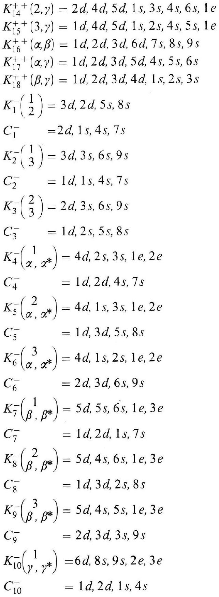

# Formula register — page 120

1 formulas from the Formelregister of [Introduction, with index of terms and formulas](../sources/BH3FR.md). The LaTeX is the MathPix reading; the scan beneath each one is the printed original.

### BH3FR_EQ0157

$$
\begin{aligned} & K_{14}^{++}(2, \gamma)=2 d, 4 d, 5 d, 1 s, 3 s, 4 s, 6 s, 1 e \\ & K_{15}^{++}(3, \gamma)=1 d, 4 d, 5 d, 1 s, 2 s, 4 s, 5 s, 1 e \\ & K_{16}^{++}(\alpha, \beta)=1 d, 2 d, 3 d, 6 d, 7 s, 8 s, 9 s \\ & K_{17}^{++}(\alpha, \gamma)=1 d, 2 d, 3 d, 5 d, 4 s, 5 s, 6 s \\ & K_{18}^{++}(\beta, \gamma)=1 d, 2 d, 3 d, 4 d, 1 s, 2 s, 3 s \\ & K_{1}^{--}\binom{1}{2}=3 d, 2 d, 5 s, 8 s \\ & C_{1}^{-} \quad=2 d, 1 s, 4 s, 7 s \\ & K_{2}^{-}\binom{1}{3}=3 d, 3 s, 6 s, 9 s \\ & C_{2}^{-} \quad=1 d, 1 s, 4 s, 7 s \\ & K_{3}^{-}\binom{2}{3}=2 d, 3 s, 6 s, 9 s \\ & C_{3}^{-} \quad=1 d, 2 s, 5 s, 8 s \\ & K_{4}^{-}\binom{1}{\alpha, \alpha^{*}}=4 d, 2 s, 3 s, 1 e, 2 e \\ & C_{4}^{-} \\ & K_{5}^{-}\binom{2}{\alpha, \alpha^{*}}=1 d, 2 d, 4 s, 7 s \\ & C_{5}^{-} \\ & K_{6}^{-}\binom{3}{\alpha, \alpha^{*}}=4 d, 1 s, 3 s, 1 e, 2 e \\ & C_{6}^{-} \\ & K_{7}^{-}\binom{1}{\beta, \beta^{*}}=2 d, 3 d, 6 s, 9 s \\ & C_{7}^{-} \\ & K_{8}^{-}\binom{2}{\beta, \beta^{*}}=1 d, 2 d, 1 s, 7 s, 4 s, 6 s, 1 e, 3 e \\ & C_{8}^{-} \\ & K_{9}^{-\left(\begin{array}{c} 3 \\ \left.\beta, \beta^{*}\right) \end{array}\right.} \\ & C_{9}^{-} \\ & K_{10}^{-}\binom{1}{\gamma, \gamma^{*}}=6 d, 3 d, 2 s, 8 s \\ & C_{10}^{-} \quad=2 d, 3 d, 3 s, 9 s, 1 e, 3 e \\ & =1 d, 2 d, 1 s, 4 s \end{aligned}
$$

*Unit `BH3FR_EQ0157`, page 120.*
