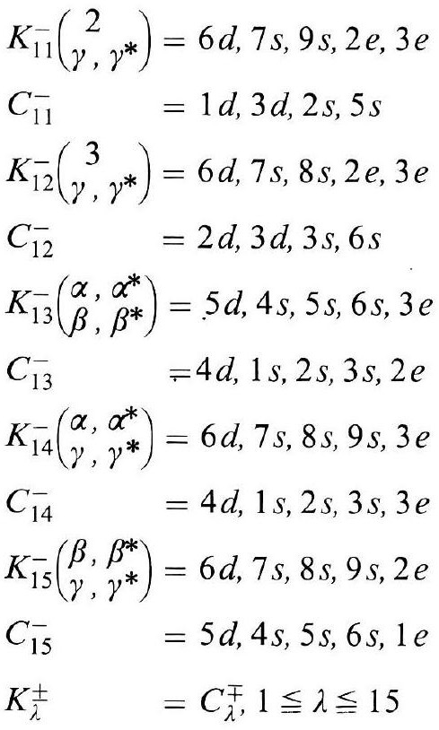
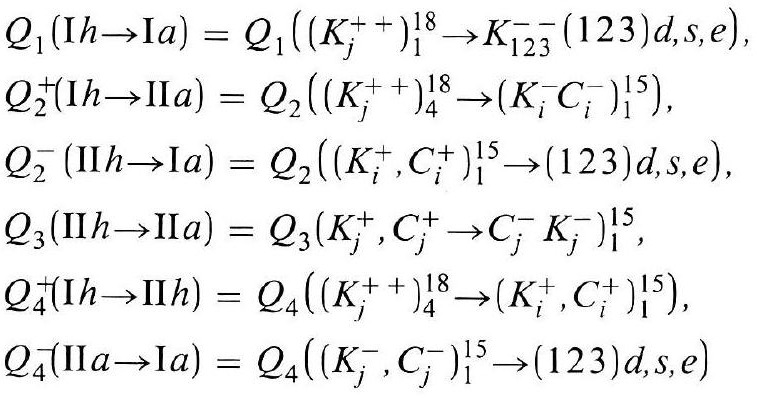
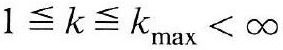
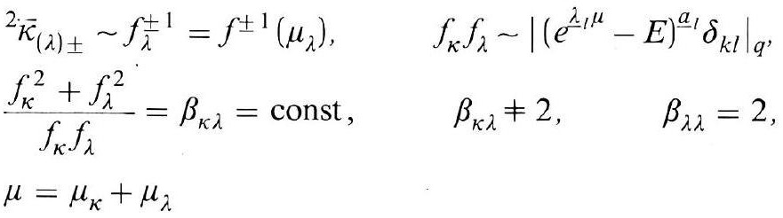

# Formula register — page 121

4 formulas from the Formelregister of [Introduction, with index of terms and formulas](../sources/BH3FR.md). The LaTeX is the MathPix reading; the scan beneath each one is the printed original.

### (71)

$$
\begin{aligned} K_{11}^{-}\binom{2}{\gamma, \gamma^{*}} & =6 d, 7 s, 9 s, 2 e, 3 e \\ C_{11}^{-} & =1 d, 3 d, 2 s, 5 s \\ K_{12}^{-}\binom{3}{\gamma, \gamma^{*}} & =6 d, 7 s, 8 s, 2 e, 3 e \\ C_{12}^{-} & =2 d, 3 d, 3 s, 6 s \\ K_{13}^{-}\binom{\alpha, \alpha^{*}}{\beta, \beta^{*}} & =5 d, 4 s, 5 s, 6 s, 3 e \\ C_{13}^{-} & =4 d, 1 s, 2 s, 3 s, 2 e \\ K_{14}^{-}\binom{\alpha, \alpha^{*}}{\gamma, \gamma^{*}} & =6 d, 7 s, 8 s, 9 s, 3 e \\ C_{14}^{-} & =4 d, 1 s, 2 s, 3 s, 3 e \\ K_{15}^{-}\binom{\beta, \beta^{*}}{\gamma, \gamma^{*}} & =6 d, 7 s, 8 s, 9 s, 2 e \\ C_{15}^{-} & =5 d, 4 s, 5 s, 6 s, 1 e \\ K_{\lambda}^{ \pm} & =C_{\lambda}^{\mp}, 1 \leqq \lambda \leqq 15 \end{aligned}
$$

*Unit `BH3FR_EQ0158`, page 121.*

### (71a)

$$
\begin{aligned} & Q_{1}(\mathrm{I} h \rightarrow \mathrm{I} a)=Q_{1}\left(\left(K_{j}^{++}\right)_{1}^{18} \rightarrow K_{123}^{--}(123) d, s, e\right), \\ & Q_{2}^{+}(\mathrm{I} h \rightarrow \mathrm{I} I a)=Q_{2}\left(\left(K_{j}^{++}\right)_{4}^{18} \rightarrow\left(K_{i}^{-} C_{i}^{-}\right)_{1}^{15}\right), \\ & Q_{2}^{-}(\mathrm{II} h \rightarrow \mathrm{I} a)=Q_{2}\left(\left(K_{i}^{+}, C_{i}^{+}\right)_{1}^{15} \rightarrow(123) d, s, e\right), \\ & Q_{3}(\mathrm{II} h \rightarrow \mathrm{II} a)=Q_{3}\left(K_{j}^{+}, C_{j}^{+} \rightarrow C_{j}^{-} K_{j}^{-}\right)_{1}^{15}, \\ & Q_{4}^{+}(\mathrm{I} h \rightarrow \mathrm{II} h)=Q_{4}\left(\left(K_{j}^{++}\right)_{4}^{18} \rightarrow\left(K_{i}^{+}, C_{i}^{+}\right)_{1}^{15}\right), \\ & Q_{4}^{-}(\mathrm{II} a \rightarrow \mathrm{I} a)=Q_{4}\left(\left(K_{j}^{-}, C_{j}^{-}\right)_{1}^{15} \rightarrow(123) d, s, e\right) \end{aligned}
$$

*Unit `BH3FR_EQ0159`, page 121.*

### (72)

$$
1 \leqq k \leqq k_{\max }<\infty
$$

*Unit `BH3FR_EQ0160`, page 121.*

### (73)

$$
\begin{aligned} & { }^{2} \bar{\kappa}_{(\lambda) \pm} \sim f_{\lambda}^{ \pm 1}=f^{ \pm 1}\left(\mu_{\lambda}\right), \quad f_{\kappa} f_{\lambda} \sim\left|\left(e^{\lambda_{1} \mu}-E\right)^{\underline{a}} \delta_{k l}\right|_{q} \\ & \frac{f_{\kappa}^{2}+f_{\lambda}^{2}}{f_{\kappa} f_{\lambda}}=\beta_{\kappa \lambda}=\mathrm{const}, \quad \beta_{\kappa \lambda} \neq 2, \quad \beta_{\lambda \lambda}=2, \\ & \mu=\mu_{\kappa}+\mu_{\lambda} \end{aligned}
$$

*Unit `BH3FR_EQ0161`, page 121.*
