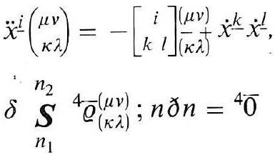
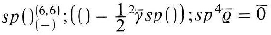
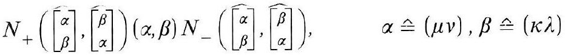
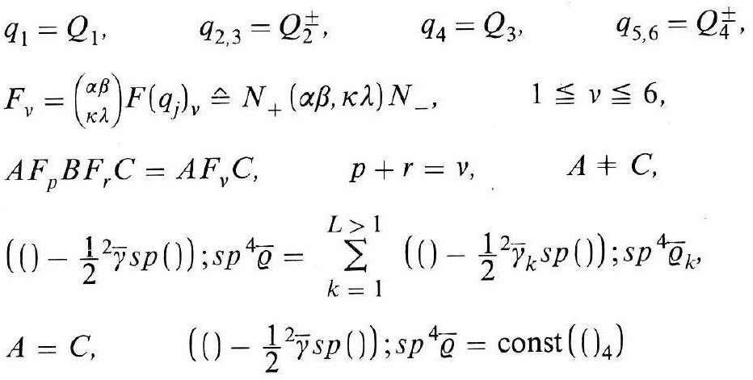
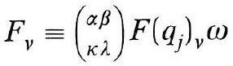
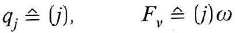

# Formula register — page 122

6 formulas from the Formelregister of [Introduction, with index of terms and formulas](../sources/BH3FR.md). The LaTeX is the MathPix reading; the scan beneath each one is the printed original.

### (74)

$$
\begin{aligned} & \left.\ddot{x}^{\underline{i}}\binom{\mu v}{\kappa \lambda}=-\left[\begin{array}{c} i \\ k l \end{array}\right]\right]_{(\kappa \lambda)}^{(\mu v)} \dot{x}^{\underline{k}} \dot{x}^{\underline{l}}, \\ & \delta{\underset{n}{S}}^{n_{2}}{ }^{4} \bar{\varrho}_{(\kappa \lambda)}^{(\mu v)} ; n \partial n={ }^{4} \overline{0} \end{aligned}
$$

*Unit `BH3FR_EQ0162`, page 122.*

### (74a)

$$
s p()_{(-)}^{(6,6)} ;\left(()-\frac{1}{2}{ }^{2} \bar{\gamma} s p()\right) ; s p^{4} \bar{\varrho}=\overline{0}
$$

*Unit `BH3FR_EQ0163`, page 122.*

### (75)

$$
N_{+}\left(\left[\begin{array}{c} \alpha \\ \beta \end{array}\right],\left[\begin{array}{c} \beta \\ \alpha \end{array}\right]\right)(\alpha, \beta) N_{-}\left(\left[\begin{array}{c} \alpha \\ \beta \end{array}\right],\left\{\begin{array}{c} \beta \\ \alpha \end{array}\right]\right), \quad \alpha \hat{=}(\mu v), \beta \hat{=}(\kappa \lambda)
$$

*Unit `BH3FR_EQ0164`, page 122.*

### (76)

$$
\begin{aligned} & q_{1}=Q_{1}, \quad q_{2,3}=Q_{2}^{ \pm}, \quad q_{4}=Q_{3}, \quad q_{5,6}=Q_{4}^{ \pm}, \\ & F_{v}=\binom{\alpha \beta}{\kappa \lambda} F\left(q_{j}\right)_{v} \hat{=} N_{+}(\alpha \beta, \kappa \lambda) N_{-}, \quad 1 \leqq \nu \leqq 6, \\ & A F_{p} B F_{r} C=A F_{v} C, \quad p+r=v, \quad A \neq C, \\ & \left(()-\frac{1}{2}{ }^{2} \bar{\gamma} s p()\right) ; s p^{4} \bar{\varrho}=\sum_{k=1}^{L>1}\left(()-\frac{1}{2}{ }^{2} \bar{\gamma}_{k} s p()\right) ; s p^{4} \bar{\varrho}_{k}, \\ & A=C, \quad\left(()-\frac{1}{2}{ }^{2} \bar{\gamma} s p()\right) ; s p^{4} \bar{\varrho}=\operatorname{const}\left(()_{4}\right) \end{aligned}
$$

*Unit `BH3FR_EQ0165`, page 122.*

### (76a)

$$
F_{v} \equiv\binom{\alpha \beta}{\kappa \lambda} F\left(q_{j}\right)_{v} \omega
$$

*Unit `BH3FR_EQ0166`, page 122.*

### (76b)

$$
q_{j} \hat{=}(j), \quad F_{v} \hat{=}(j) \omega
$$

*Unit `BH3FR_EQ0167`, page 122.*
