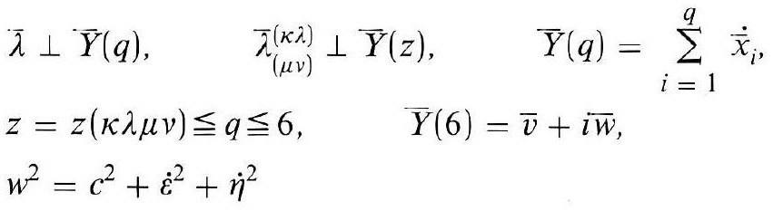
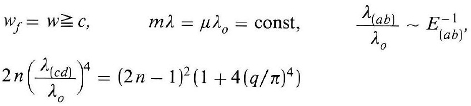
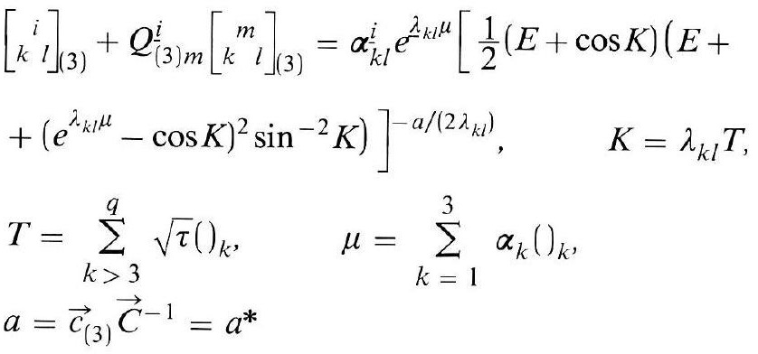
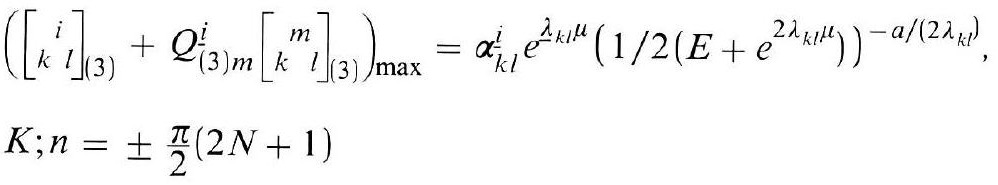
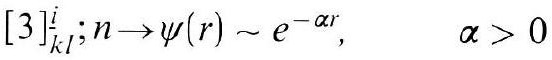
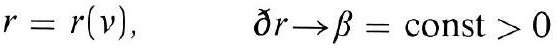

# Formula register — page 123

6 formulas from the Formelregister of [Introduction, with index of terms and formulas](../sources/BH3FR.md). The LaTeX is the MathPix reading; the scan beneath each one is the printed original.

### (77)

$$
\begin{aligned} & \bar{\lambda} \perp \bar{Y}(q), \quad \bar{\lambda}_{(\mu \nu)}^{(\kappa \lambda)} \perp \bar{Y}(z), \quad \bar{Y}(q)=\sum_{i=1}^{q} \dot{\bar{x}}_{i}, \\ & z=z(\kappa \lambda \mu \nu) \leqq q \leqq 6, \quad \bar{Y}(6)=\bar{v}+i \bar{w}, \\ & w^{2}=c^{2}+\dot{\varepsilon}^{2}+\dot{\eta}^{2}, \end{aligned}
$$

*Unit `BH3FR_EQ0168`, page 123.*

### (78)

$$
\begin{aligned} & w_{f}=w \geqq c, \quad m \lambda=\mu \lambda_{o}=\text { const }, \quad \frac{\lambda_{(a b)}}{\lambda_{o}} \sim E_{(a b)}^{-1} \\ & 2 n\left(\frac{\lambda_{(c d)}}{\lambda_{o}}\right)^{4}=(2 n-1)^{2}\left(1+4(q / \pi)^{4}\right) \end{aligned}
$$

*Unit `BH3FR_EQ0169`, page 123.*

### (79)

$$
\begin{aligned} & {\left[\begin{array}{c} i \\ k l \end{array}\right]_{(3)}+Q_{(3) m}^{i}\left[\begin{array}{c} m \\ k \end{array}\right]_{(3)}=\alpha_{k l}^{i} e^{\lambda_{k l} \mu}\left[\frac{1}{2}(E+\cos K)(E+\right.} \\ & \left.\left.+\left(e^{\lambda_{k l} \mu}-\cos K\right)^{2} \sin ^{-2} K\right)\right]^{-a /\left(2 \lambda_{k l}\right)}, \quad K=\lambda_{k l} T, \\ & T=\sum_{k>3}^{q} \sqrt{\tau}()_{k}, \quad \mu=\sum_{k=1}^{3} \alpha_{k}()_{k}, \\ & a=\vec{c}_{(3)} \vec{C}^{-1}=a^{*} \end{aligned}
$$

*Unit `BH3FR_EQ0170`, page 123.*

### (79a)

$$
\begin{aligned} & \left(\left[\begin{array}{c} i \\ k l \end{array}\right]_{(3)}+Q_{(3) m}^{i}\left[\begin{array}{c} m \\ k l \end{array}\right]_{(3)}\right)_{\max }=\alpha_{k l}^{i} e^{\lambda_{k l} \mu}\left(1 / 2\left(E+e^{2 \lambda_{k l} \mu}\right)\right)^{-a /\left(2 \lambda_{k l}\right)}, \\ & K ; n= \pm \frac{\pi}{2}(2 N+1) \end{aligned}
$$

*Unit `BH3FR_EQ0171`, page 123.*

### (79b)

$$
[3]_{k l}^{i} ; n \rightarrow \psi(r) \sim e^{-\alpha r}, \quad \alpha>0
$$

*Unit `BH3FR_EQ0172`, page 123.*

### (79 c)

$$
r=r(v), \quad \text { ð } r \rightarrow \beta=\text { const }>0
$$

*Unit `BH3FR_EQ0173`, page 123.*
