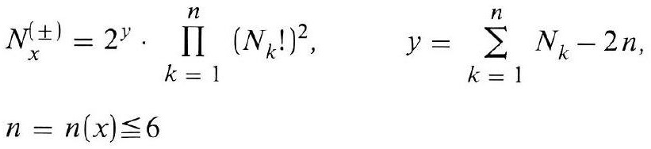
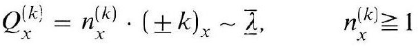
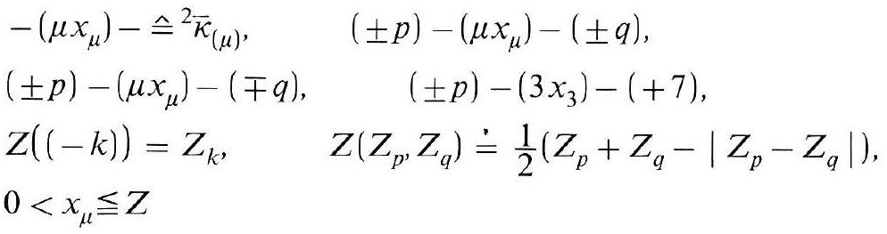
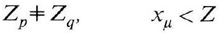
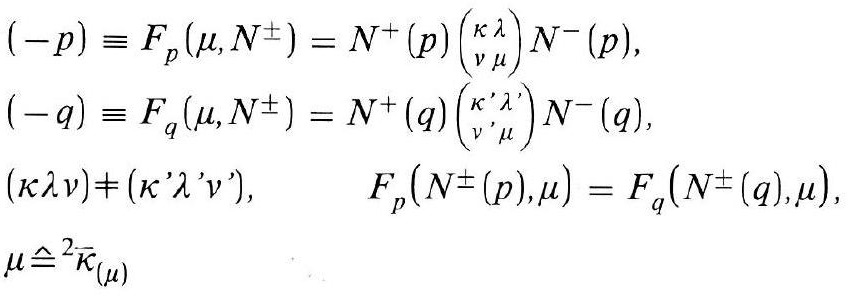
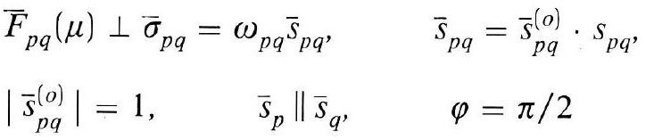
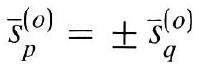

# Formula register — page 125

7 formulas from the Formelregister of [Introduction, with index of terms and formulas](../sources/BH3FR.md). The LaTeX is the MathPix reading; the scan beneath each one is the printed original.

### (83a)

$$
\begin{aligned} & N_{x}^{( \pm)}=2^{y} \cdot \prod_{k=1}^{n}\left(N_{k}!\right)^{2}, \quad y=\sum_{k=1}^{n} N_{k}-2 n \\ & n=n(x) \leqq 6 \end{aligned}
$$

*Unit `BH3FR_EQ0180`, page 125.*

### (83b)

$$
Q_{x}^{(k)}=n_{x}^{(k)} \cdot( \pm k)_{x} \sim \underline{\bar{\lambda}}, \quad n_{x}^{(k)} \geqq 1
$$

*Unit `BH3FR_EQ0181`, page 125.*

### (84)

$$
\begin{array}{lr} -\left(\mu x_{\mu}\right)-\hat{=}^{2} \bar{\kappa}_{(\mu)}, & ( \pm p)-\left(\mu x_{\mu}\right)-( \pm q) \\ ( \pm p)-\left(\mu x_{\mu}\right)-(\mp q), & ( \pm p)-\left(3 x_{3}\right)-(+7) \\ Z((-k))=Z_{k}, & Z\left(Z_{p}, Z_{q}\right) \doteq \frac{1}{2}\left(Z_{p}+Z_{q}-\left|Z_{p}-Z_{q}\right|\right), \\ 0<x_{\mu} \leqq Z & \end{array}
$$

*Unit `BH3FR_EQ0182`, page 125.*

### (84a)

$$
Z_{p} \neq Z_{q}, \quad x_{\mu}<Z
$$

*Unit `BH3FR_EQ0183`, page 125.*

### (85)

$$
\begin{aligned} & (-p) \equiv F_{p}\left(\mu, N^{ \pm}\right)=N^{+}(p)\binom{\kappa \lambda}{v} N^{-}(p) \\ & (-q) \equiv F_{q}\left(\mu, N^{ \pm}\right)=N^{+}(q)\binom{\kappa^{\prime} \lambda^{\prime}}{v^{\prime} \mu} N^{-}(q) \\ & (\kappa \lambda v) \neq\left(\kappa^{\prime} \lambda^{\prime} v^{\prime}\right), \quad F_{p}\left(N^{ \pm}(p), \mu\right)=F_{q}\left(N^{ \pm}(q), \mu\right), \\ & \mu \stackrel{\wedge}{=}{ }^{2} \bar{\kappa}_{(\mu)} \end{aligned}
$$

*Unit `BH3FR_EQ0184`, page 125.*

### (85a)

$$
\begin{array}{ll} \bar{F}_{p q}(\mu) \perp \bar{\sigma}_{p q}=\omega_{p q} \bar{s}_{p q}, & \bar{s}_{p q}=\bar{s}_{p q}^{(o)} \cdot s_{p q}, \\ \left|\bar{s}_{p q}^{(o)}\right|=1, & \bar{s}_{p} \| \bar{s}_{q}, \\ & \varphi=\pi / 2 \end{array}
$$

*Unit `BH3FR_EQ0185`, page 125.*

### (85b)

$$
\bar{s}_{p}^{(o)}= \pm \bar{s}_{q}^{(o)}
$$

*Unit `BH3FR_EQ0186`, page 125.*
