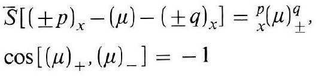
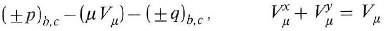
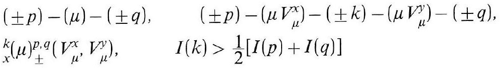
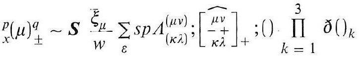
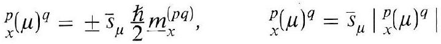
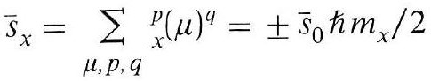
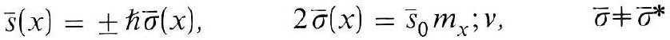
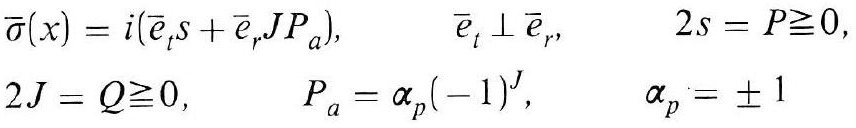
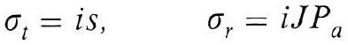

# Formula register — page 126

9 formulas from the Formelregister of [Introduction, with index of terms and formulas](../sources/BH3FR.md). The LaTeX is the MathPix reading; the scan beneath each one is the printed original.

### (86)

$$
\begin{aligned} & \bar{S}\left[( \pm p)_{x}-(\mu)-( \pm q)_{x}\right]={ }_{x}^{p}(\mu)_{ \pm}^{q} \\ & \cos \left[(\mu)_{+},(\mu)_{-}\right]=-1 \end{aligned}
$$

*Unit `BH3FR_EQ0187`, page 126.*

### (86a)

$$
( \pm p)_{b, c}-\left(\mu V_{\mu}\right)-( \pm q)_{b, c}, \quad V_{\mu}^{x}+V_{\mu}^{y}=V_{\mu}
$$

*Unit `BH3FR_EQ0188`, page 126.*

### (86b)

$$
\begin{array}{ll} ( \pm p)-(\mu)-( \pm q), & ( \pm p)-\left(\mu V_{\mu}^{x}\right)-( \pm k)-\left(\mu V_{\mu}^{y}\right)-( \pm q), \\ { }_{x}^{k}(\mu)_{ \pm}^{p, q}\left(V_{\mu}^{x}, V_{\mu}^{y}\right), & I(k)>\frac{1}{2}[I(p)+I(q)] \end{array}
$$

*Unit `BH3FR_EQ0189`, page 126.*

### (87)

$$
{ }_{x}^{p}(\mu)_{ \pm}^{q} \sim S \frac{\bar{\xi}_{\mu}}{w} \sum_{\varepsilon} s p \Lambda_{(\kappa \lambda)}^{(\mu v)} ;\left[\begin{array}{c} \widehat{\mu v} \\ -\frac{1}{\kappa \lambda} \end{array}\right]_{+} ;() \prod_{k=1}^{3} \partial()_{k}
$$

*Unit `BH3FR_EQ0190`, page 126.*

### (87 a)

$$
{ }_{x}^{p}(\mu)^{q}= \pm \bar{s}_{\mu} \frac{\hbar}{2} \underline{m}_{x}^{(p q)}, \quad{ }_{x}^{p}(\mu)^{q}=\left.\bar{s}_{\mu}\right|_{x} ^{p}(\mu)^{q} \mid
$$

*Unit `BH3FR_EQ0191`, page 126.*

### (88)

$$
\bar{s}_{x}=\sum_{\mu, p, q}{ }_{x}^{p}(\mu)^{q}= \pm \bar{s}_{0} \hbar m_{x} / 2
$$

*Unit `BH3FR_EQ0192`, page 126.*

### (88а)

$$
\bar{s}(x)= \pm \hbar \bar{\sigma}(x), \quad 2 \bar{\sigma}(x)=\bar{s}_{0} m_{x} ; v, \quad \bar{\sigma} \neq \bar{\sigma}^{*}
$$

*Unit `BH3FR_EQ0193`, page 126.*

### (89)

$$
\begin{aligned} & \bar{\sigma}(x)=i\left(\bar{e}_{t} s+\bar{e}_{r} J P_{a}\right), \quad \bar{e}_{t} \perp \bar{e}_{r}, \quad 2 s=P \geqq 0, \\ & 2 J=Q \geqq 0, \quad P_{a}=\alpha_{p}(-1)^{J}, \quad \alpha_{p}= \pm 1 \end{aligned}
$$

*Unit `BH3FR_EQ0194`, page 126.*

### (89a)

$$
\sigma_{t}=i s, \quad \sigma_{r}=i J P_{a}
$$

*Unit `BH3FR_EQ0195`, page 126.*
