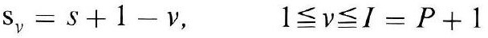
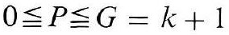
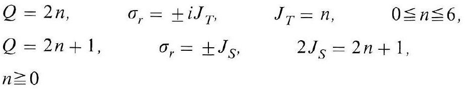
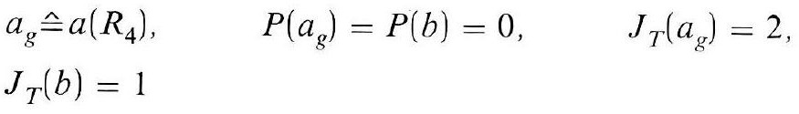
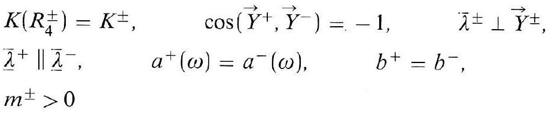
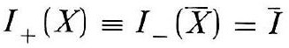
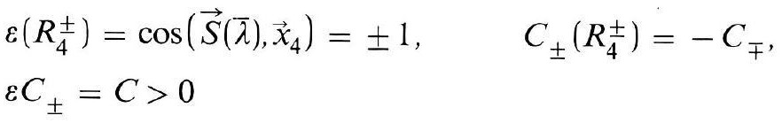
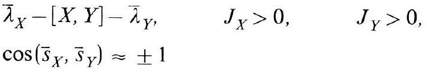
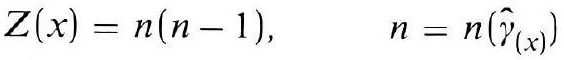

# Formula register — page 127

9 formulas from the Formelregister of [Introduction, with index of terms and formulas](../sources/BH3FR.md). The LaTeX is the MathPix reading; the scan beneath each one is the printed original.

### (90)

$$
\mathrm{s}_{v}=s+1-v, \quad 1 \leqq v \leqq I=P+1
$$

*Unit `BH3FR_EQ0196`, page 127.*

### (90a)

$$
0 \leqq P \leqq G=k+1
$$

*Unit `BH3FR_EQ0197`, page 127.*

### (91)

$$
\begin{array}{lcc} Q=2 n, & \sigma_{r}= \pm i J_{T}, & J_{T}=n, \\ Q=2 n+1, & \sigma_{r}= \pm J_{S}, & 2 J_{S}=2 n+1 \\ n \geqq 0 & & \end{array}
$$

*Unit `BH3FR_EQ0198`, page 127.*

### (91a)

$$
\begin{aligned} & a_{g} \hat{=} a\left(R_{4}\right), \quad P\left(a_{g}\right)=P(b)=0, \quad J_{T}\left(a_{g}\right)=2, \\ & J_{T}(b)=1 \end{aligned}
$$

*Unit `BH3FR_EQ0199`, page 127.*

### (92)

$$
\begin{aligned} & K\left(R_{4}^{ \pm}\right)=K^{ \pm}, \quad \cos \left(\vec{Y}^{+}, \vec{Y}^{-}\right)=-1, \quad \bar{\lambda}^{ \pm} \perp \vec{Y}^{ \pm}, \\ & \bar{\lambda}^{+} \| \bar{\lambda}^{-}, \quad a^{+}(\omega)=a^{-}(\omega), \quad b^{+}=b^{-}, \\ & m^{ \pm}>0 \end{aligned}
$$

*Unit `BH3FR_EQ0200`, page 127.*

### (92a)

$$
I_{+}(X) \equiv I_{-}(\bar{X})=\bar{I}
$$

*Unit `BH3FR_EQ0201`, page 127.*

### (93)

$$
\begin{aligned} & \varepsilon\left(R_{4}^{ \pm}\right)=\cos \left(\vec{S}(\vec{\lambda}), \vec{x}_{4}\right)= \pm 1, \quad C_{ \pm}\left(R_{4}^{ \pm}\right)=-C_{\mp} \\ & \varepsilon C_{ \pm}=C>0 \end{aligned}
$$

*Unit `BH3FR_EQ0202`, page 127.*

### (94)

$$
\begin{aligned} & \bar{\lambda}_{X}-[X, Y]-\bar{\lambda}_{Y}, \quad J_{X}>0, \quad J_{Y}>0 \\ & \cos \left(\bar{s}_{X}, \bar{s}_{Y}\right) \approx \pm 1 \end{aligned}
$$

*Unit `BH3FR_EQ0203`, page 127.*

### (95)

$$
Z(x)=n(n-1), \quad n=n\left(\hat{\gamma}_{(x)}\right)
$$

*Unit `BH3FR_EQ0204`, page 127.*
