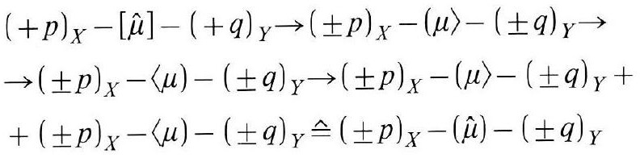
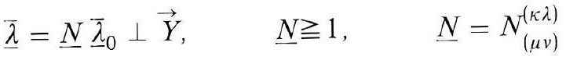
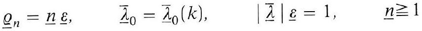
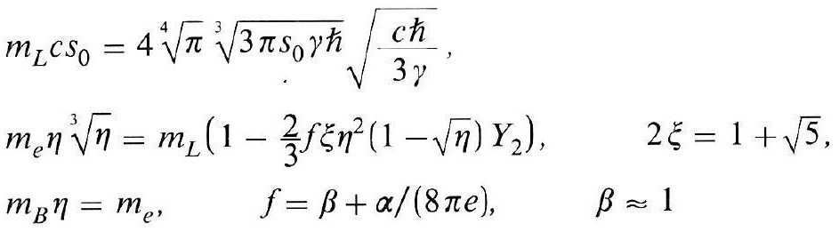
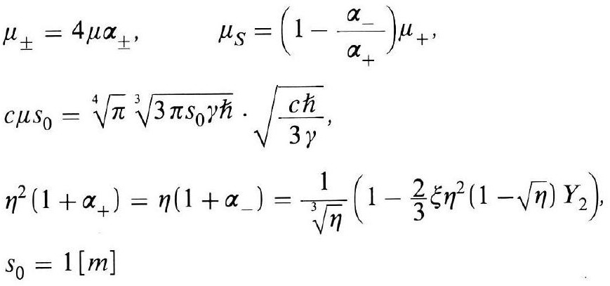
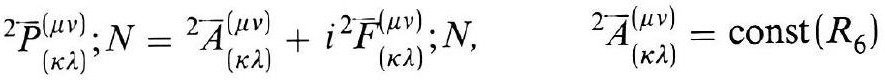

# Formula register — page 128

6 formulas from the Formelregister of [Introduction, with index of terms and formulas](../sources/BH3FR.md). The LaTeX is the MathPix reading; the scan beneath each one is the printed original.

### (95a)

$$
\begin{aligned} & (+p)_{X}-[\hat{\mu}]-(+q)_{Y} \rightarrow( \pm p)_{X}-(\mu\rangle-( \pm q)_{Y} \rightarrow \\ & \rightarrow( \pm p)_{X}-\langle\mu)-( \pm q)_{Y} \rightarrow( \pm p)_{X}-(\mu\rangle-( \pm q)_{Y}+ \\ & +( \pm p)_{X}-\langle\mu)-( \pm q)_{Y} \hat{=}( \pm p)_{X}-(\hat{\mu})-( \pm q)_{Y} \end{aligned}
$$

*Unit `BH3FR_EQ0205`, page 128.*

### (96)

$$
\overline{\hat{\lambda}}=\underline{N} \overline{\underline{\lambda}}_{0} \perp \vec{Y}, \quad \underline{N} \geqq 1, \quad \underline{N}=N_{(\mu \nu)}^{(\kappa \lambda)}
$$

*Unit `BH3FR_EQ0206`, page 128.*

### (96a)

$$
\underline{\varrho}_{n}=\underline{n} \underline{\varepsilon}, \quad \bar{\lambda}_{0}=\bar{\lambda}_{0}(k), \quad|\underline{\bar{\lambda}}| \underline{\varepsilon}=1, \quad \underline{n} \geqq 1
$$

*Unit `BH3FR_EQ0207`, page 128.*

### (96b)

$$
\begin{aligned} & m_{L} c s_{0}=4 \sqrt[4]{\pi} \sqrt[3]{3 \pi s_{0} \gamma \hbar} \sqrt{\frac{c \hbar}{3 \gamma}}, \\ & m_{e} \eta \sqrt[3]{\eta}=m_{L}\left(1-\frac{2}{3} f \xi \eta^{2}(1-\sqrt{\eta}) Y_{2}\right), \quad 2 \xi=1+\sqrt{5}, \\ & m_{B} \eta=m_{e}, \quad f=\beta+\alpha /(8 \pi e), \quad \beta \approx 1 \end{aligned}
$$

*Unit `BH3FR_EQ0208`, page 128.*

### (97)

$$
\begin{aligned} & \mu_{ \pm}=4 \mu \alpha_{ \pm}, \quad \mu_{S}=\left(1-\frac{\alpha_{-}}{\alpha_{+}}\right) \mu_{+} \\ & c \mu s_{0}=\sqrt[4]{\pi} \sqrt[3]{3 \pi s_{0} \gamma \hbar} \cdot \sqrt{\frac{c \hbar}{3 \gamma}} \\ & \eta^{2}\left(1+\alpha_{+}\right)=\eta\left(1+\alpha_{-}\right)=\frac{1}{\sqrt[3]{\eta}}\left(1-\frac{2}{3} \xi \eta^{2}(1-\sqrt{\eta}) Y_{2}\right) \\ & s_{0}=1[\mathrm{~m}] \end{aligned}
$$

*Unit `BH3FR_EQ0209`, page 128.*

### (97a)

$$
{ }^{2} \bar{P}_{(\kappa \lambda)}^{(\mu \nu)} ; N={ }^{2} \bar{A}_{(\kappa \lambda)}^{(\mu \nu)}+i^{2} \bar{F}_{(\kappa \lambda)}^{(\mu \nu)} ; N, \quad{ }^{2} \bar{A}_{(\kappa \lambda)}^{(\mu \nu)}=\operatorname{const}\left(R_{6}\right)
$$

*Unit `BH3FR_EQ0210`, page 128.*
