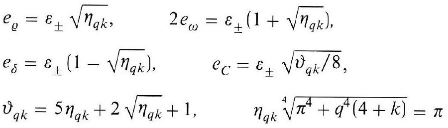
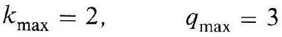
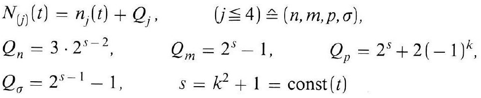
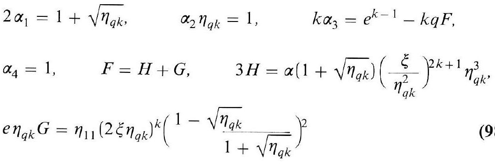
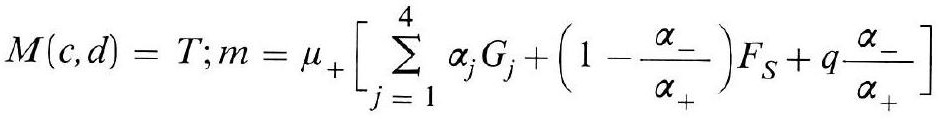
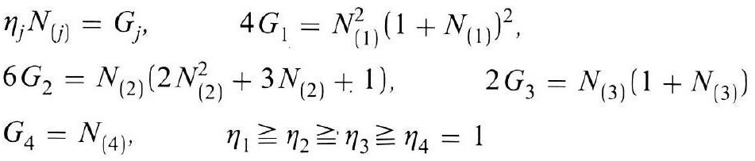

# Formula register — page 129

6 formulas from the Formelregister of [Introduction, with index of terms and formulas](../sources/BH3FR.md). The LaTeX is the MathPix reading; the scan beneath each one is the printed original.

### (98)

$$
\begin{aligned} & e_{\varrho}=\varepsilon_{ \pm} \sqrt{\eta_{q k}}, \quad 2 e_{\omega}=\varepsilon_{ \pm}\left(1+\sqrt{\eta_{q k}}\right) \\ & e_{\delta}=\varepsilon_{ \pm}\left(1-\sqrt{\eta_{q k}}\right), \quad e_{C}=\varepsilon_{ \pm} \sqrt{\vartheta_{q k} / 8} \\ & \vartheta_{q k}=5 \eta_{q k}+2 \sqrt{\eta_{q k}}+1, \quad \eta_{q k} \sqrt[4]{\pi^{4}+q^{4}(4+k)}=\pi \end{aligned}
$$

*Unit `BH3FR_EQ0211`, page 129.*

### (98а)

$$
k_{\max }=2, \quad q_{\max }=3
$$

*Unit `BH3FR_EQ0212`, page 129.*

### (98b)

$$
\begin{aligned} & N_{(j)}(t)=n_{j}(t)+Q_{j}, \quad(j \leqq 4) \hat{=}(n, m, p, \sigma), \\ & Q_{n}=3 \cdot 2^{s-2}, \quad Q_{m}=2^{s}-1, \quad Q_{p}=2^{s}+2(-1)^{k}, \\ & Q_{\sigma}=2^{s-1}-1, \quad s=k^{2}+1=\operatorname{const}(t) \end{aligned}
$$

*Unit `BH3FR_EQ0213`, page 129.*

### (98c)

$$
\begin{aligned} & 2 \alpha_{1}=1+\sqrt{\eta_{q k}}, \quad \alpha_{2} \eta_{q k}=1, \quad k \alpha_{3}=e^{k-1}-k q F, \\ & \alpha_{4}=1, \quad F=H+G, \quad 3 H=\alpha\left(1+\sqrt{\eta_{q k}}\right)\left(\frac{\xi}{\eta_{q k}^{2}}\right)^{2 k+1} \eta_{q k}^{3}, \\ & e \eta_{q k} G=\eta_{11}\left(2 \xi \eta_{q k}\right)^{k}\left(1-\frac{\sqrt{\eta_{q k}}}{1+\sqrt{\eta_{q k}}}\right)^{2} \end{aligned}
$$

*Unit `BH3FR_EQ0214`, page 129.*

### (98d)

$$
M(c, d)=T ; m=\mu_{+}\left[\sum_{j=1}^{4} \alpha_{j} G_{j}+\left(1-\frac{\alpha_{-}}{\alpha_{+}}\right) F_{S}+q \frac{\alpha_{-}}{\alpha_{+}}\right]
$$

*Unit `BH3FR_EQ0215`, page 129.*

### (98e)

$$
\begin{aligned} & \eta_{j} N_{(j)}=G_{j}, \quad 4 G_{1}=N_{(1)}^{2}\left(1+N_{(1)}\right)^{2}, \\ & 6 G_{2}=N_{(2)}\left(2 N_{(2)}^{2}+3 N_{(2)}+1\right), \quad 2 G_{3}=N_{(3)}\left(1+N_{(3)}\right) \\ & G_{4}=N_{(4)}, \quad \eta_{1} \geqq \eta_{2} \geqq \eta_{3} \geqq \eta_{4}=1 \end{aligned}
$$

*Unit `BH3FR_EQ0216`, page 129.*
