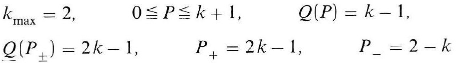
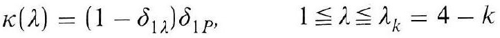
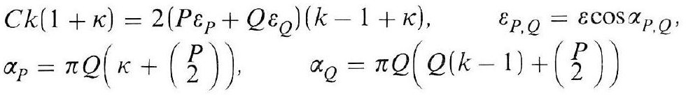
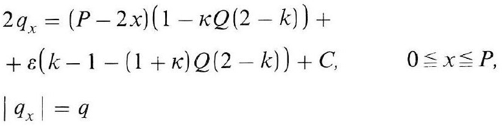
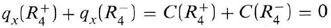
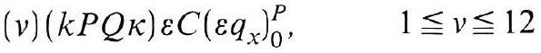

# Formula register — page 130

6 formulas from the Formelregister of [Introduction, with index of terms and formulas](../sources/BH3FR.md). The LaTeX is the MathPix reading; the scan beneath each one is the printed original.

### (99)

$$
\begin{aligned} & k_{\max }=2, \quad 0 \leqq P \leqq k+1, \quad Q(P)=k-1, \\ & Q\left(P_{ \pm}\right)=2 k-1, \quad P_{+}=2 k-1, \quad P_{-}=2-k \end{aligned}
$$

*Unit `BH3FR_EQ0217`, page 130.*

### (99a)

$$
\kappa(\lambda)=\left(1-\delta_{1 \lambda}\right) \delta_{1 P}, \quad 1 \leqq \lambda \leqq \lambda_{k}=4-k
$$

*Unit `BH3FR_EQ0218`, page 130.*

### (100)

$$
\begin{aligned} & C k(1+\kappa)=2\left(P \varepsilon_{P}+Q \varepsilon_{Q}\right)(k-1+\kappa), \quad \varepsilon_{P, Q}=\varepsilon \cos \alpha_{P, Q}, \\ & \alpha_{P}=\pi Q\left(\kappa+\binom{P}{2}\right), \quad \alpha_{Q}=\pi Q\left(Q(k-1)+\binom{P}{2}\right) \end{aligned}
$$

*Unit `BH3FR_EQ0219`, page 130.*

### (100a)

$$
\begin{aligned} & 2 q_{x}=(P-2 x)(1-\kappa Q(2-k))+ \\ & +\varepsilon(k-1-(1+\kappa) Q(2-k))+C, \quad 0 \leqq x \leqq P, \\ & \left|q_{x}\right|=q \end{aligned}
$$

*Unit `BH3FR_EQ0220`, page 130.*

### (100b)

$$
q_{x}\left(R_{4}^{+}\right)+q_{x}\left(R_{4}^{-}\right)=C\left(R_{4}^{+}\right)+C\left(R_{4}^{-}\right)=0
$$

*Unit `BH3FR_EQ0221`, page 130.*

### (101)

$$
(v)(k P Q \kappa) \varepsilon C\left(\varepsilon q_{x}\right)_{0}^{P}, \quad 1 \leqq v \leqq 12
$$

*Unit `BH3FR_EQ0222`, page 130.*
