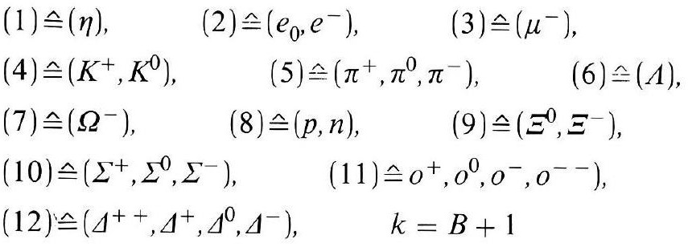
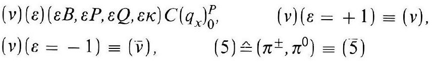
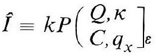
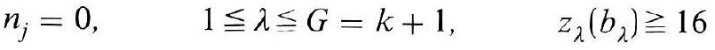
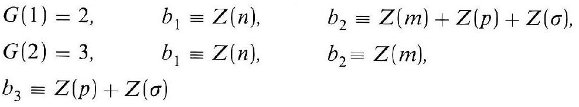
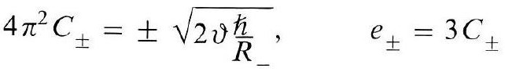
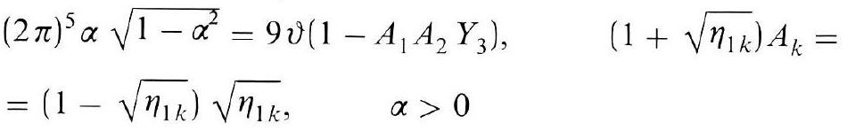
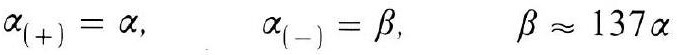

# Formula register — page 131

8 formulas from the Formelregister of [Introduction, with index of terms and formulas](../sources/BH3FR.md). The LaTeX is the MathPix reading; the scan beneath each one is the printed original.

### (101b)

$$
\begin{aligned} & (1) \hat{=}(\eta), \quad(2) \hat{=}\left(e_{0}, e^{-}\right), \quad(3) \hat{=}\left(\mu^{-}\right), \\ & (4) \hat{=}\left(K^{+}, K^{0}\right), \quad(5) \hat{=}\left(\pi^{+}, \pi^{0}, \pi^{-}\right), \quad(6) \hat{=}(\Lambda), \\ & (7) \hat{=}\left(\Omega^{-}\right), \quad(8) \hat{=}(p, n), \quad(9) \hat{=}\left(\Xi^{0}, \Xi^{-}\right), \\ & \left.(10) \hat{=}\left(\Sigma^{+}, \Sigma^{0}, \Sigma^{-}\right), \quad(11) \hat{=} o^{+}, o^{0}, o^{-}, o^{--}\right), \\ & (12) \triangleq\left(\Delta^{++}, \Delta^{+}, \Delta^{0}, \Delta^{-}\right), \quad k=B+1 \end{aligned}
$$

*Unit `BH3FR_EQ0223`, page 131.*

### (101c)

$$
\begin{aligned} & (v)(\varepsilon)(\varepsilon B, \varepsilon P, \varepsilon Q, \varepsilon \kappa) C\left(q_{x}\right)_{0}^{P}, \quad(v)(\varepsilon=+1) \equiv(v), \\ & (v)(\varepsilon=-1) \equiv(\bar{v}), \quad(5) \hat{=}\left(\pi^{ \pm}, \pi^{0}\right) \equiv(\overline{5}) \end{aligned}
$$

*Unit `BH3FR_EQ0224`, page 131.*

### (102)

$$
\hat{I} \equiv k P\left(\begin{array}{l} Q, \kappa \\ C, q_{x} \end{array}\right]_{\varepsilon}
$$

*Unit `BH3FR_EQ0225`, page 131.*

### (103)

$$
n_{j}=0, \quad 1 \leqq \lambda \leqq G=k+1, \quad z_{\lambda}\left(b_{\lambda}\right) \geqq 16
$$

*Unit `BH3FR_EQ0226`, page 131.*

### (103a)

$$
\begin{array}{lll} G(1)=2, & b_{1} \equiv Z(n), & b_{2} \equiv Z(m)+Z(p)+Z(\sigma), \\ G(2)=3, & b_{1} \equiv Z(n), & b_{2} \equiv Z(m), \\ b_{3} \equiv Z(p)+Z(\sigma) & \end{array}
$$

*Unit `BH3FR_EQ0227`, page 131.*

### (104)

$$
4 \pi^{2} C_{ \pm}= \pm \sqrt{2 v \frac{\hbar}{R_{-}}}, \quad e_{ \pm}=3 C_{ \pm}
$$

*Unit `BH3FR_EQ0228`, page 131.*

### (105)

$$
\begin{aligned} & (2 \pi)^{5} \alpha \sqrt{1-\alpha^{2}}=9 \vartheta\left(1-A_{1} A_{2} Y_{3}\right), \quad\left(1+\sqrt{\eta_{1 k}}\right) A_{k}= \\ & =\left(1-\sqrt{\eta_{1 k}}\right) \sqrt{\eta_{1 k}}, \quad \alpha>0 \end{aligned}
$$

*Unit `BH3FR_EQ0229`, page 131.*

### (105a)

$$
\alpha_{(+)}=\alpha, \quad \alpha_{(-)}=\beta, \quad \beta \approx 137 \alpha
$$

*Unit `BH3FR_EQ0230`, page 131.*
