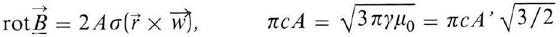
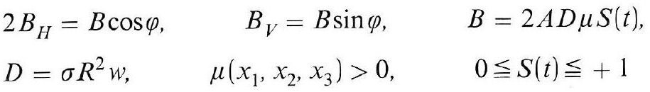
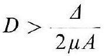
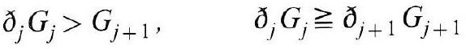
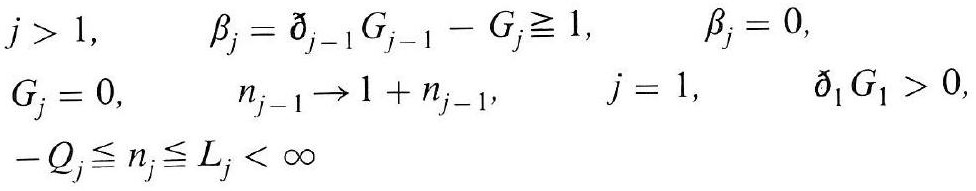
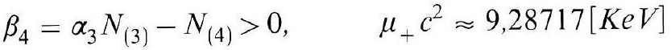
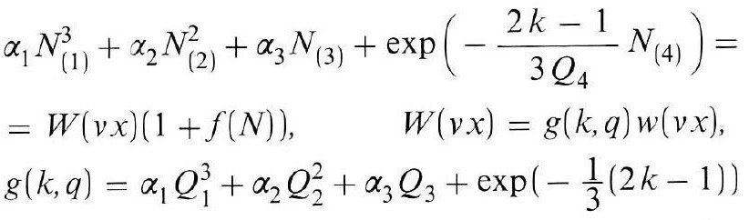

# Formula register — page 132

7 formulas from the Formelregister of [Introduction, with index of terms and formulas](../sources/BH3FR.md). The LaTeX is the MathPix reading; the scan beneath each one is the printed original.

### (106)

$$
\operatorname{rot} \underline{B}=2 A \sigma(\vec{r} \times \vec{w}), \quad \pi c A=\sqrt{3 \pi \gamma \mu_{0}}=\pi c A^{\prime} \sqrt{3 / 2}
$$

*Unit `BH3FR_EQ0231`, page 132.*

### (106a)

$$
\begin{array}{lcc} 2 B_{H}=B \cos \varphi, & B_{V}=B \sin \varphi, & B=2 A D \mu S(t), \\ D=\sigma R^{2} w, & \mu\left(x_{1}, x_{2}, x_{3}\right)>0, & 0 \leqq S(t) \leqq+1 \end{array}
$$

*Unit `BH3FR_EQ0232`, page 132.*

### (106b)

$$
D>\frac{\Delta}{2 \mu A}
$$

*Unit `BH3FR_EQ0233`, page 132.*

### (107)

$$
\partial_{j} G_{j}>G_{j+1}, \quad \partial_{j} G_{j} \geqq \partial_{j+1} G_{j+1}
$$

*Unit `BH3FR_EQ0234`, page 132.*

### (107a)

$$
\begin{aligned} & j>1, \quad \beta_{j}=ð_{j-1} G_{j-1}-G_{j} \geqq 1, \quad \beta_{j}=0, \\ & G_{j}=0, \quad n_{j-1} \rightarrow 1+n_{j-1}, \quad j=1, \quad \partial_{1} G_{1}>0, \\ & -Q_{j} \leqq n_{j} \leqq L_{j}<\infty \end{aligned}
$$

*Unit `BH3FR_EQ0235`, page 132.*

### (107b)

$$
\beta_{4}=\alpha_{3} N_{(3)}-N_{(4)}>0, \quad \mu_{+} c^{2} \approx 9,28717[\mathrm{KeV}]
$$

*Unit `BH3FR_EQ0236`, page 132.*

### (108)

$$
\begin{aligned} & \alpha_{1} N_{(1)}^{3}+\alpha_{2} N_{(2)}^{2}+\alpha_{3} N_{(3)}+\exp \left(-\frac{2 k-1}{3 Q_{4}} N_{(4)}\right)= \\ & =W(v x)(1+f(N)), \quad W(v x)=g(k, q) w(v x), \\ & g(k, q)=\alpha_{1} Q_{1}^{3}+\alpha_{2} Q_{2}^{2}+\alpha_{3} Q_{3}+\exp \left(-\frac{1}{3}(2 k-1)\right) \end{aligned}
$$

*Unit `BH3FR_EQ0237`, page 132.*
