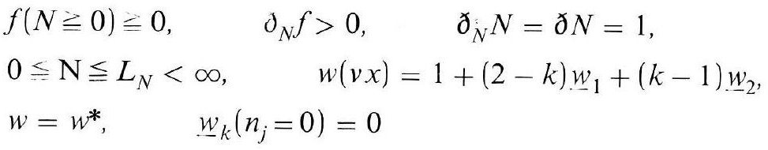
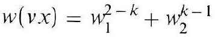
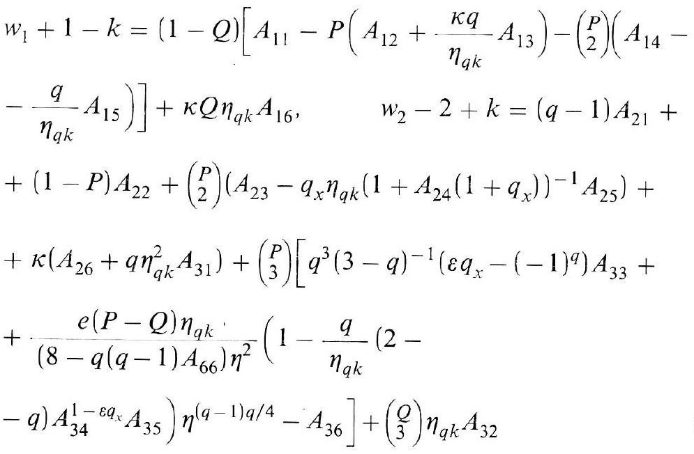
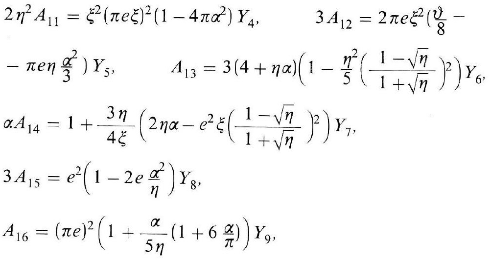

# Formula register — page 133

4 formulas from the Formelregister of [Introduction, with index of terms and formulas](../sources/BH3FR.md). The LaTeX is the MathPix reading; the scan beneath each one is the printed original.

### (108a)

$$
\begin{aligned} & f(N \geqq 0) \fallingdotseq 0, \quad \partial_{N} f>0, \quad \partial_{N} N=\partial N=1, \\ & 0 \leqq \mathrm{~N} \leqq L_{N}<\infty, \quad w(v x)=1+(2-k) \underline{w}_{1}+(k-1) \underline{w}_{2}, \\ & w=w^{*}, \quad \underline{w}_{k}\left(n_{j}=0\right)=0 \end{aligned}
$$

*Unit `BH3FR_EQ0238`, page 133.*

### (109)

$$
w(v x)=w_{1}^{2-k}+w_{2}^{k-1}
$$

*Unit `BH3FR_EQ0239`, page 133.*

### (109a)

$$
\begin{aligned} & w_{1}+1-k=(1-Q)\left[A_{11}-P\left(A_{12}+\frac{\kappa q}{\eta_{q k}} A_{13}\right)-\binom{P}{2}\left(A_{14}-\right.\right. \\ & \left.\left.-\frac{q}{\eta_{q k}} A_{15}\right)\right]+\kappa Q \eta_{q k} A_{16}, \quad w_{2}-2+k=(q-1) A_{21}+ \\ & +(1-P) A_{22}+\binom{P}{2}\left(A_{23}-q_{x} \eta_{q k}\left(1+A_{24}\left(1+q_{x}\right)\right)^{-1} A_{25}\right)+ \\ & +\kappa\left(A_{26}+q \eta_{q k}^{2} A_{31}\right)+\binom{P}{3}\left[q^{3}(3-q)^{-1}\left(\varepsilon q_{x}-(-1)^{q}\right) A_{33}+\right. \\ & +\frac{e(P-Q) \eta_{q k}}{\left(8-q(q-1) A_{66}\right) \eta^{2}}\left(1-\frac{q}{\eta_{q k}}(2-\right. \\ & \left.\left.-q) A_{34}^{1-\varepsilon q_{x}} A_{35}\right) \eta^{(q-1) q / 4}-A_{36}\right]+\binom{Q}{3} \eta_{q k} A_{32} \end{aligned}
$$

*Unit `BH3FR_EQ0240`, page 133.*

### BH3FR_EQ0241

$$
\begin{aligned} & 2 \eta^{2} A_{11}=\xi^{2}(\pi e \xi)^{2}\left(1-4 \pi \alpha^{2}\right) Y_{4}, \quad 3 A_{12}=2 \pi e \xi^{2}\left(\frac{\vartheta}{8}-\right. \\ & \left.-\pi e \eta \frac{\alpha^{2}}{3}\right) Y_{5}, \quad A_{13}=3(4+\eta \alpha)\left(1-\frac{\eta^{2}}{5}\left(\frac{1-\sqrt{\eta}}{1+\sqrt{\eta}}\right)^{2}\right) Y_{6}, \\ & \alpha A_{14}=1+\frac{3 \eta}{4 \xi}\left(2 \eta \alpha-e^{2} \xi\left(\frac{1-\sqrt{\eta}}{1+\sqrt{\eta}}\right)^{2}\right) Y_{7}, \\ & 3 A_{15}=e^{2}\left(1-2 e \frac{\alpha^{2}}{\eta}\right) Y_{8}, \\ & A_{16}=(\pi e)^{2}\left(1+\frac{\alpha}{5 \eta}\left(1+6 \frac{\alpha}{\pi}\right)\right) Y_{9}, \end{aligned}
$$

*Unit `BH3FR_EQ0241`, page 133.*
