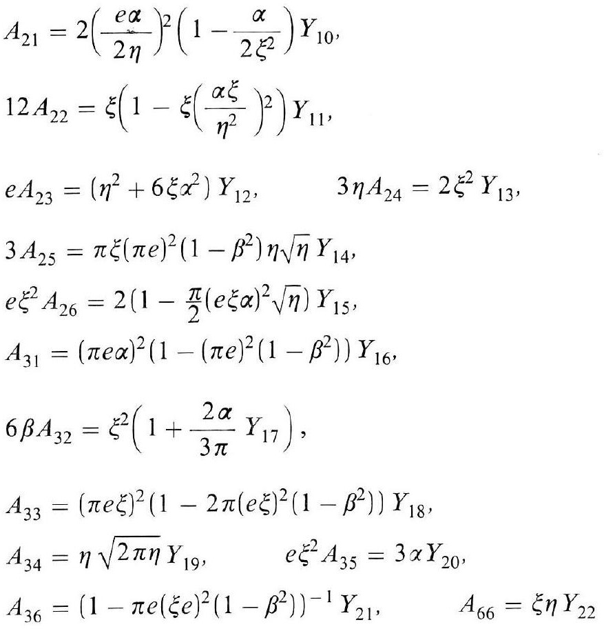
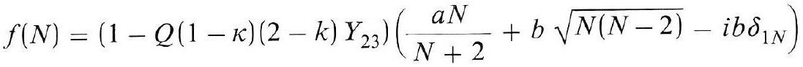
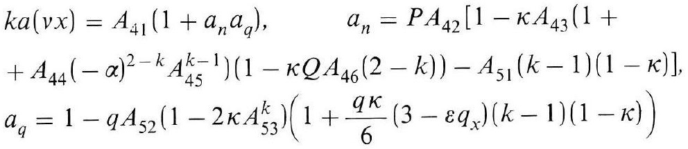

# Formula register — page 134

3 formulas from the Formelregister of [Introduction, with index of terms and formulas](../sources/BH3FR.md). The LaTeX is the MathPix reading; the scan beneath each one is the printed original.

### (109b)

$$
\begin{aligned} & A_{21}=2\left(\frac{e \alpha}{2 \eta}\right)^{2}\left(1-\frac{\alpha}{2 \xi^{2}}\right) Y_{10}, \\ & 12 A_{22}=\xi\left(1-\xi\left(\frac{\alpha \xi}{\eta^{2}}\right)^{2}\right) Y_{11}, \\ & e A_{23}=\left(\eta^{2}+6 \xi \alpha^{2}\right) Y_{12}, \quad 3 \eta A_{24}=2 \xi^{2} Y_{13}, \\ & 3 A_{25}=\pi \xi(\pi e)^{2}\left(1-\beta^{2}\right) \eta \sqrt{\eta} Y_{14}, \\ & e \xi^{2} A_{26}=2\left(1-\frac{\pi}{2}(e \xi \alpha)^{2} \sqrt{\eta}\right) Y_{15}, \\ & A_{31}=(\pi e \alpha)^{2}\left(1-(\pi e)^{2}\left(1-\beta^{2}\right)\right) Y_{16}, \\ & 6 \beta A_{32}=\xi^{2}\left(1+\frac{2 \alpha}{3 \pi} Y_{17}\right), \\ & A_{33}=(\pi e \xi)^{2}\left(1-2 \pi(e \xi)^{2}\left(1-\beta^{2}\right)\right) Y_{18}, \\ & A_{34}=\eta \sqrt{2 \pi \eta} Y_{19}, \quad e \xi^{2} A_{35}=3 \alpha Y_{20}, \\ & A_{36}=\left(1-\pi e(\xi e)^{2}\left(1-\beta^{2}\right)\right)^{-1} Y_{21}, \quad A_{66}=\xi \eta Y_{22} \end{aligned}
$$

*Unit `BH3FR_EQ0242`, page 134.*

### (110)

$$
f(N)=\left(1-Q(1-\kappa)(2-k) Y_{23}\right)\left(\frac{a N}{N+2}+b \sqrt{N(N-2)}-i b \delta_{1 N}\right)
$$

*Unit `BH3FR_EQ0243`, page 134.*

### (110a)

$$
\begin{aligned} & k a(v x)=A_{41}\left(1+a_{n} a_{q}\right), \quad a_{n}=P A_{42}\left[1-\kappa A_{43}(1+\right. \\ & \left.\left.+A_{44}(-\alpha)^{2-k} A_{45}^{k-1}\right)\left(1-\kappa Q A_{46}(2-k)\right)-A_{51}(k-1)(1-\kappa)\right], \\ & a_{q}=1-q A_{52}\left(1-2 \kappa A_{53}^{k}\right)\left(1+\frac{q \kappa}{6}\left(3-\varepsilon q_{x}\right)(k-1)(1-\kappa)\right) \end{aligned}
$$

*Unit `BH3FR_EQ0244`, page 134.*
