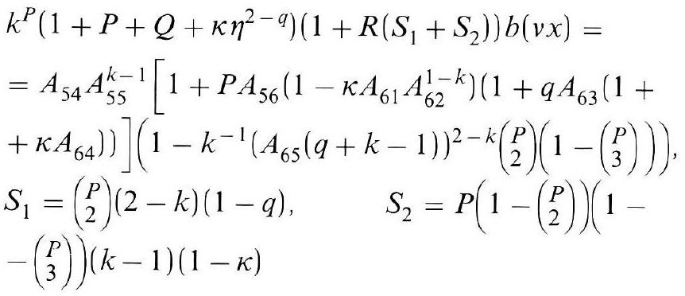
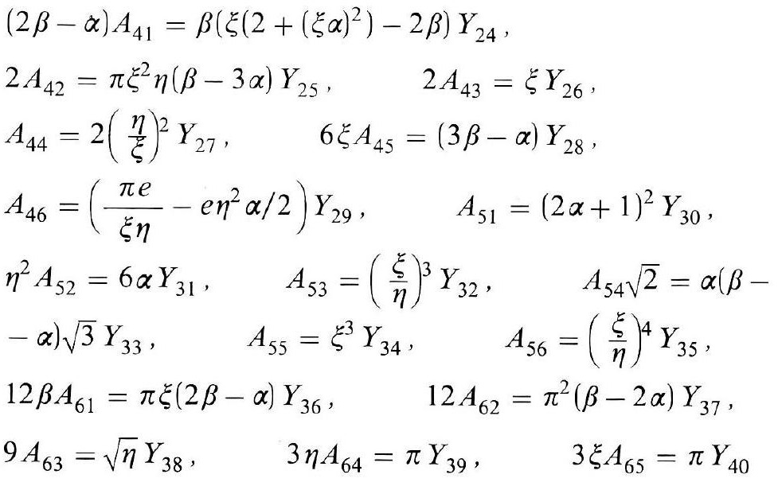
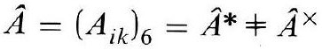
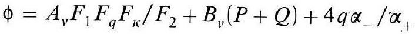

# Formula register — page 135

4 formulas from the Formelregister of [Introduction, with index of terms and formulas](../sources/BH3FR.md). The LaTeX is the MathPix reading; the scan beneath each one is the printed original.

### (110b)

$$
\begin{aligned} & k^{P}\left(1+P+Q+\kappa \eta^{2-q}\right)\left(1+R\left(S_{1}+S_{2}\right)\right) b(v x)= \\ & =A_{54} A_{55}^{k-1}\left[1+P A_{56}\left(1-\kappa A_{61} A_{62}^{1-k}\right)\left(1+q A_{63}(1+\right.\right. \\ & \left.\left.\left.+\kappa A_{64}\right)\right)\right]\left(1-k^{-1}\left(A_{65}(q+k-1)\right)^{2-k}\binom{P}{2}\left(1-\binom{P}{3}\right)\right) \\ & S_{1}=\binom{P}{2}(2-k)(1-q), \quad S_{2}=P\left(1-\binom{P}{2}\right)(1- \\ & \left.-\binom{P}{3}\right)(k-1)(1-\kappa) \end{aligned}
$$

*Unit `BH3FR_EQ0245`, page 135.*

### (110c)

$$
\begin{aligned} & (2 \beta-\alpha) A_{41}=\beta\left(\xi\left(2+(\xi \alpha)^{2}\right)-2 \beta\right) Y_{24}, \\ & 2 A_{42}=\pi \xi^{2} \eta(\beta-3 \alpha) Y_{25}, \quad 2 A_{43}=\xi Y_{26}, \\ & A_{44}=2\left(\frac{\eta}{\xi}\right)^{2} Y_{27}, \quad 6 \xi A_{45}=(3 \beta-\alpha) Y_{28}, \\ & A_{46}=\left(\frac{\pi e}{\xi \eta}-e \eta^{2} \alpha / 2\right) Y_{29}, \quad A_{51}=(2 \alpha+1)^{2} Y_{30}, \\ & \eta^{2} A_{52}=6 \alpha Y_{31}, \quad A_{53}=\left(\frac{\xi}{\eta}\right)^{3} Y_{32}, \quad A_{54} \sqrt{2}=\alpha(\beta- \\ & -\alpha) \sqrt{3} Y_{33}, \quad A_{55}=\xi^{3} Y_{34}, \quad A_{56}=\left(\frac{\xi}{\eta}\right)^{4} Y_{35}, \\ & 12 \beta A_{61}=\pi \xi(2 \beta-\alpha) Y_{36}, \quad 12 A_{62}=\pi^{2}(\beta-2 \alpha) Y_{37}, \\ & 9 A_{63}=\sqrt{\eta} Y_{38}, \quad 3 \eta A_{64}=\pi Y_{39}, \quad 3 \xi A_{65}=\pi Y_{40} \end{aligned}
$$

*Unit `BH3FR_EQ0246`, page 135.*

### (110d)

$$
\hat{A}=\left(A_{i k}\right)_{6}=\hat{A}^{*} \neq \hat{A}^{\times}
$$

*Unit `BH3FR_EQ0247`, page 135.*

### (111)

$$
\phi=A_{v} F_{1} F_{q} F_{\kappa} / F_{2}+B_{v}(P+Q)+4 q \alpha_{-} / \alpha_{+}
$$

*Unit `BH3FR_EQ0248`, page 135.*
