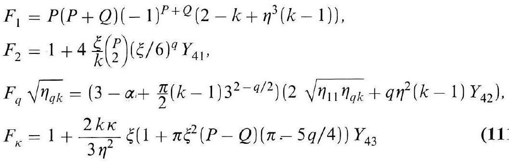
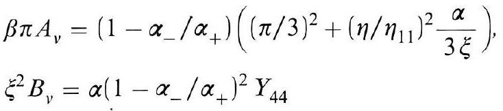
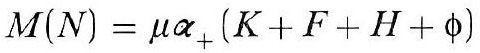
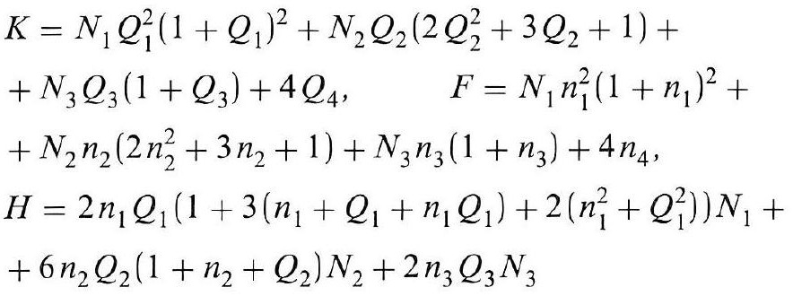
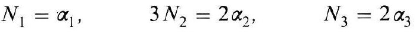
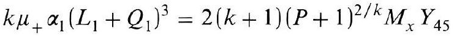
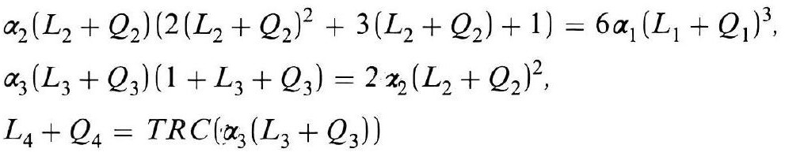

# Formula register — page 136

7 formulas from the Formelregister of [Introduction, with index of terms and formulas](../sources/BH3FR.md). The LaTeX is the MathPix reading; the scan beneath each one is the printed original.

### (111a)

$$
\begin{aligned} & F_{1}=P(P+Q)(-1)^{P+Q}\left(2-k+\eta^{3}(k-1)\right), \\ & F_{2}=1+4 \frac{\xi}{k}\binom{P}{2}(\xi / 6)^{q} Y_{41}, \\ & F_{q} \sqrt{\eta_{q k}}=\left(3-\alpha+\frac{\pi}{2}(k-1) 3^{2-q / 2}\right)\left(2 \sqrt{\eta_{11} \eta_{q k}}+q \eta^{2}(k-1) Y_{42}\right), \\ & F_{\kappa}=1+\frac{2 k \kappa}{3 \eta^{2}} \xi\left(1+\pi \xi^{2}(P-Q)(\pi-5 q / 4)\right) Y_{43} \end{aligned}
$$

*Unit `BH3FR_EQ0249`, page 136.*

### (111b)

$$
\begin{aligned} & \beta \pi A_{v}=\left(1-\alpha_{-} / \alpha_{+}\right)\left((\pi / 3)^{2}+\left(\eta / \eta_{11}\right)^{2} \frac{\alpha}{3 \xi}\right) \\ & \xi^{2} B_{v}=\alpha\left(1-\alpha_{-} / \alpha_{+}\right)^{2} Y_{44} \end{aligned}
$$

*Unit `BH3FR_EQ0250`, page 136.*

### (112)

$$
M(N)=\mu \alpha_{+}(K+F+H+\phi)
$$

*Unit `BH3FR_EQ0251`, page 136.*

### (112a)

$$
\begin{aligned} & K=N_{1} Q_{1}^{2}\left(1+Q_{1}\right)^{2}+N_{2} Q_{2}\left(2 Q_{2}^{2}+3 Q_{2}+1\right)+ \\ & +N_{3} Q_{3}\left(1+Q_{3}\right)+4 Q_{4}, \quad F=N_{1} n_{1}^{2}\left(1+n_{1}\right)^{2}+ \\ & +N_{2} n_{2}\left(2 n_{2}^{2}+3 n_{2}+1\right)+N_{3} n_{3}\left(1+n_{3}\right)+4 n_{4} \\ & H=2 n_{1} Q_{1}\left(1+3\left(n_{1}+Q_{1}+n_{1} Q_{1}\right)+2\left(n_{1}^{2}+Q_{1}^{2}\right)\right) N_{1}+ \\ & +6 n_{2} Q_{2}\left(1+n_{2}+Q_{2}\right) N_{2}+2 n_{3} Q_{3} N_{3} \end{aligned}
$$

*Unit `BH3FR_EQ0252`, page 136.*

### (112b)

$$
N_{1}=\alpha_{1}, \quad 3 N_{2}=2 \alpha_{2}, \quad N_{3}=2 \alpha_{3}
$$

*Unit `BH3FR_EQ0253`, page 136.*

### (113)

$$
k \mu_{+} \alpha_{1}\left(L_{1}+Q_{1}\right)^{3}=2(k+1)(P+1)^{2 / k} M_{x} Y_{45}
$$

*Unit `BH3FR_EQ0254`, page 136.*

### (113a)

$$
\begin{aligned} & \alpha_{2}\left(L_{2}+Q_{2}\right)\left(2\left(L_{2}+Q_{2}\right)^{2}+3\left(L_{2}+Q_{2}\right)+1\right)=6 \alpha_{1}\left(L_{1}+Q_{1}\right)^{3}, \\ & \alpha_{3}\left(L_{3}+Q_{3}\right)\left(1+L_{3}+Q_{3}\right)=2 \alpha_{2}\left(L_{2}+Q_{2}\right)^{2}, \\ & L_{4}+Q_{4}=T R C\left(\alpha_{3}\left(L_{3}+Q_{3}\right)\right) \end{aligned}
$$

*Unit `BH3FR_EQ0255`, page 136.*
