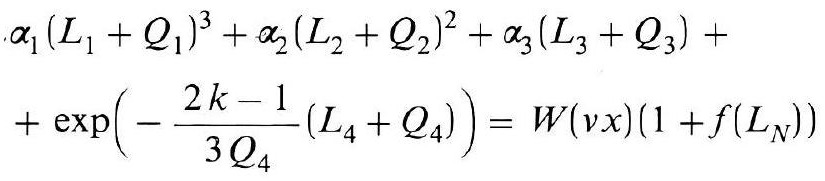
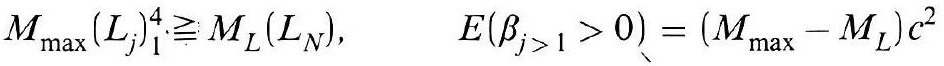
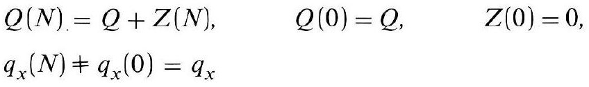
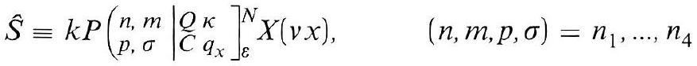
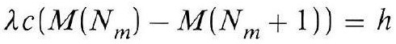
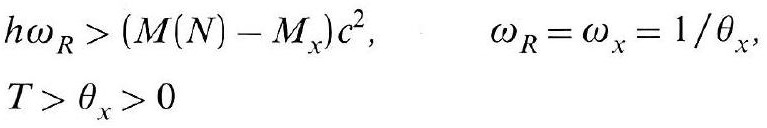
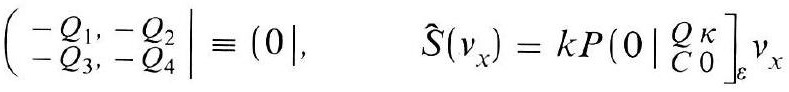
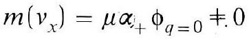

# Formula register — page 137

8 formulas from the Formelregister of [Introduction, with index of terms and formulas](../sources/BH3FR.md). The LaTeX is the MathPix reading; the scan beneath each one is the printed original.

### (113b)

$$
\begin{aligned} & \alpha_{1}\left(L_{1}+Q_{1}\right)^{3}+\alpha_{2}\left(L_{2}+Q_{2}\right)^{2}+\alpha_{3}\left(L_{3}+Q_{3}\right)+ \\ & +\exp \left(-\frac{2 k-1}{3 Q_{4}}\left(L_{4}+Q_{4}\right)\right)=W(v x)\left(1+f\left(L_{N}\right)\right) \end{aligned}
$$

*Unit `BH3FR_EQ0256`, page 137.*

### (113c)

$$
M_{\max }\left(L_{j}\right)_{1}^{4} \geqq M_{L}\left(L_{N}\right), \quad E\left(\beta_{j>1}>0\right)=\left(M_{\max }-M_{L}\right) c^{2}
$$

*Unit `BH3FR_EQ0257`, page 137.*

### (114)

$$
\begin{aligned} & Q(N)=Q+Z(N), \quad Q(0)=Q, \quad Z(0)=0, \\ & q_{x}(N) \neq q_{x}(0)=q_{x} \end{aligned}
$$

*Unit `BH3FR_EQ0258`, page 137.*

### (115)

$$
\hat{S} \equiv k P\left(\left.\begin{array}{l|l} n, m & Q \kappa \\ p, \sigma \end{array}\right|_{C q_{x}} ^{N}\right]_{\varepsilon}^{N} X(v x), \quad(n, m, p, \sigma)=n_{1}, \ldots, n_{4}
$$

*Unit `BH3FR_EQ0259`, page 137.*

### (116)

$$
\lambda c\left(M\left(N_{m}\right)-M\left(N_{m}+1\right)\right)=h
$$

*Unit `BH3FR_EQ0260`, page 137.*

### (117)

$$
\begin{aligned} & h \omega_{R}>\left(M(N)-M_{x}\right) c^{2}, \quad \omega_{R}=\omega_{x}=1 / \theta_{x}, \\ & T>\theta_{x}>0 \end{aligned}
$$

*Unit `BH3FR_EQ0261`, page 137.*

### (118)

$$
\left(\left.\begin{array}{l} -Q_{1},-Q_{2} \\ -Q_{3},-Q_{4} \end{array} \right\rvert\, \equiv\left(0 \mid, \quad \hat{S}\left(v_{x}\right)=k P\left(0 \mid \underset{\widetilde{C} 0}{Q} \underset{\varepsilon}{\kappa} v_{x} v_{x}\right.\right.\right.
$$

*Unit `BH3FR_EQ0262`, page 137.*

### (118a)

$$
m\left(v_{x}\right)=\mu \alpha_{+} \phi_{q=0} \neq 0
$$

*Unit `BH3FR_EQ0263`, page 137.*
